מדריך זה נוצר במסגרת פרוייקט [בקורס מדעי הרוח הדיגיטליים](https://www.cs.bgu.ac.il/~tdh202/Main), בהנחיית דר' יעל נצר, המחלקה למדעי המחשב, אוניברסיטת בן גוריון. 
מטרת המדריך היא להנגיש חלקים מרכזיים במדריך הרחב של OMEKA על מנת לאפשר לחסרי ניסיון והיכרות עם אומקה למידה והתנסות מהירה עם הפלטפורמה.

## התחברות והורדה של OMEKA S ל RECLAIM HOSTING
היכנסו -ל [reclaimhosting](https://reclaimhosting.com), ליחצו על products->shared hosting  והירשמו לשרת במסלול "personal".
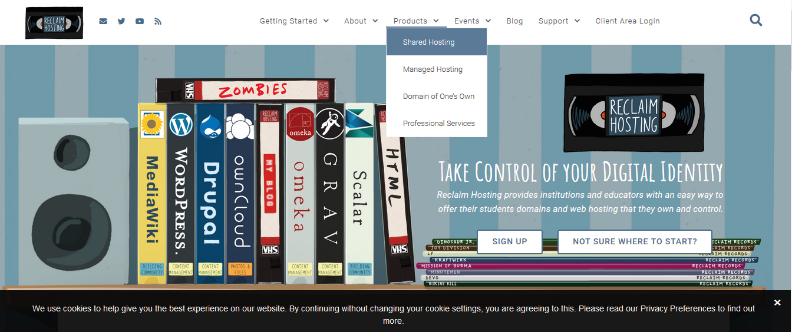

לאחר ההרשמה יש להיכנס ל client Area בעזרת מייל משתמש וססמא שהזנתם בעת ההרשמה:
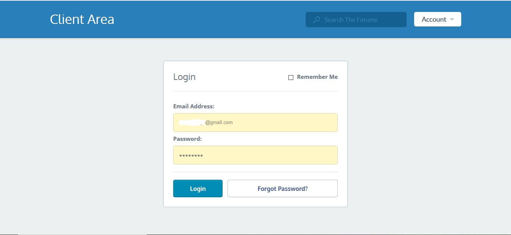

זה דף הבית בכניסה:
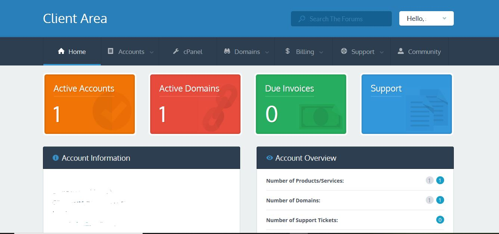

כעת, המנוי האישי מאפשר לכם דומיין יחיד, יש ליצור אותו לפני ההתקנה של OMEKA S :
1.  היכנסו ל domains-> Register a New Domain:
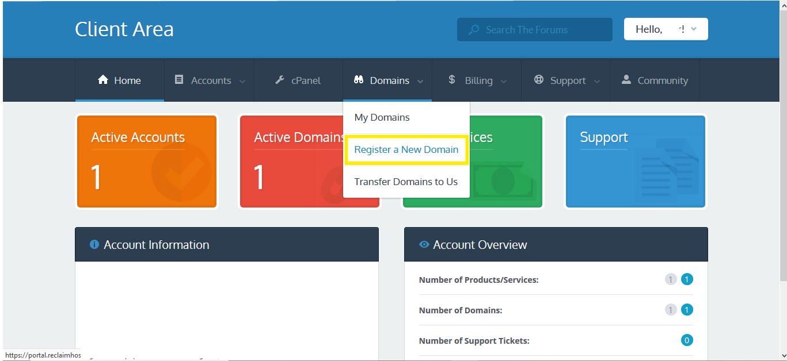

2. יש להכניס שם עבור הכתובת הרצויה וללחוץ על check Availability במידה והכתובת פנויה יתאפשר לכם ללחוץ על "continue" :
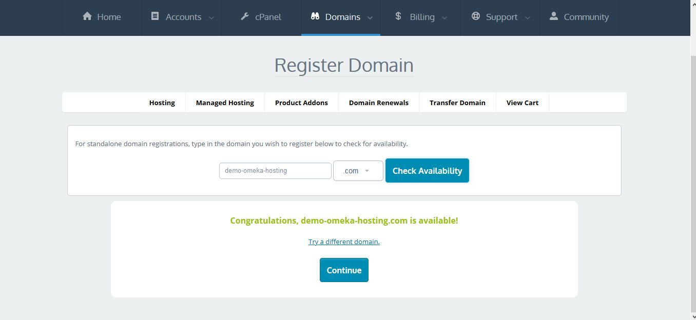

3. יש לפעול בהמשך ע"פי ההוראות הבסיסיות. בסיום התהליך תוכלו לראות את הדומיין שיצרתם ב "Active Domain" בדף הבית.
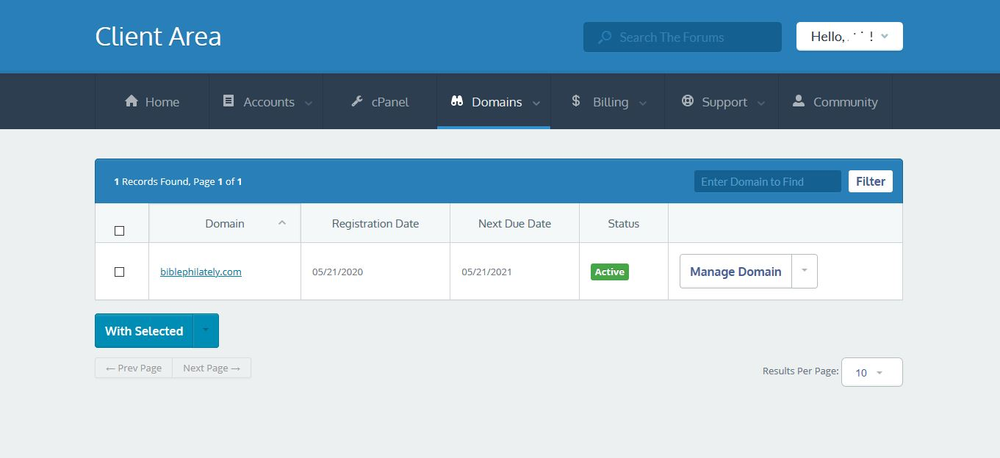

כעת, ניתן להתקין את OMEKA S :

1. כנסו ל "Cpanel" מדף הבית:	
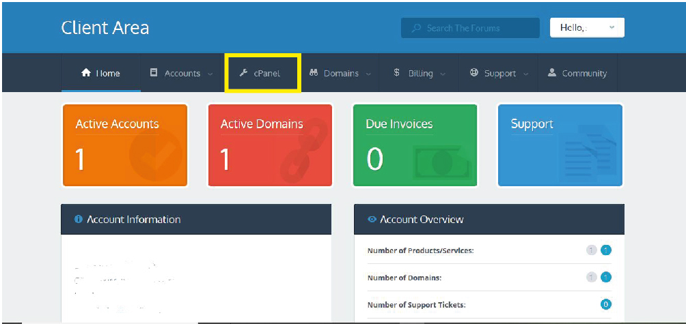

2. לחצו על "All Applications":
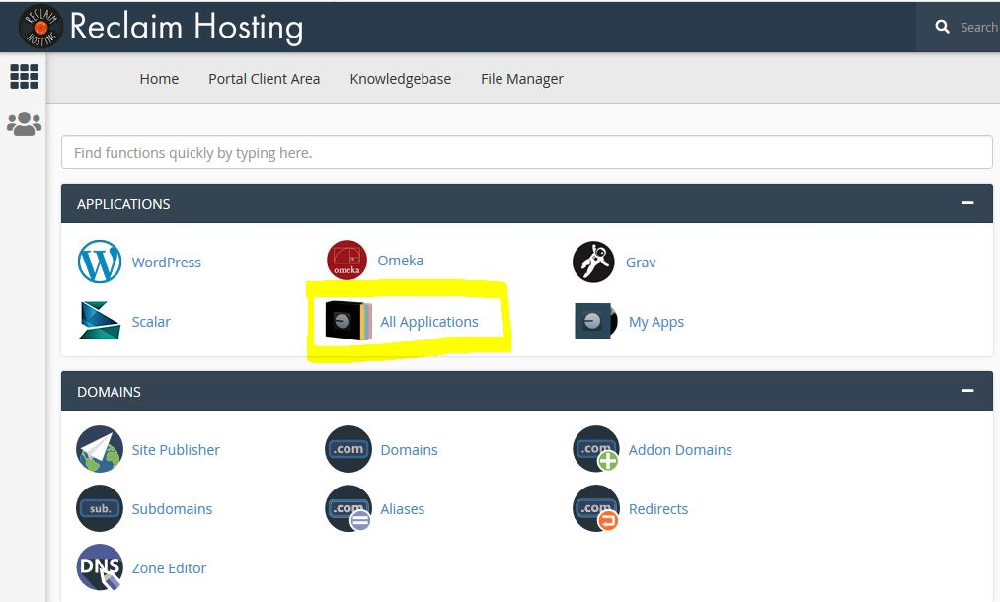

3. חפשו את "OMEKA S" (קל בעזרת ctrl+f) ולחצו:
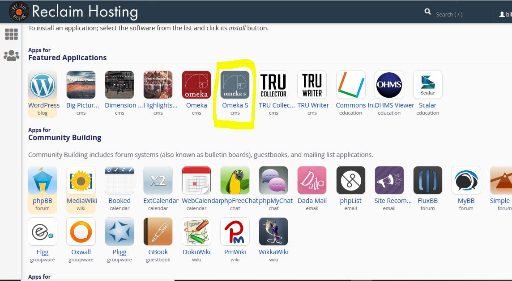

4. יש ללחוץ על "install this application":
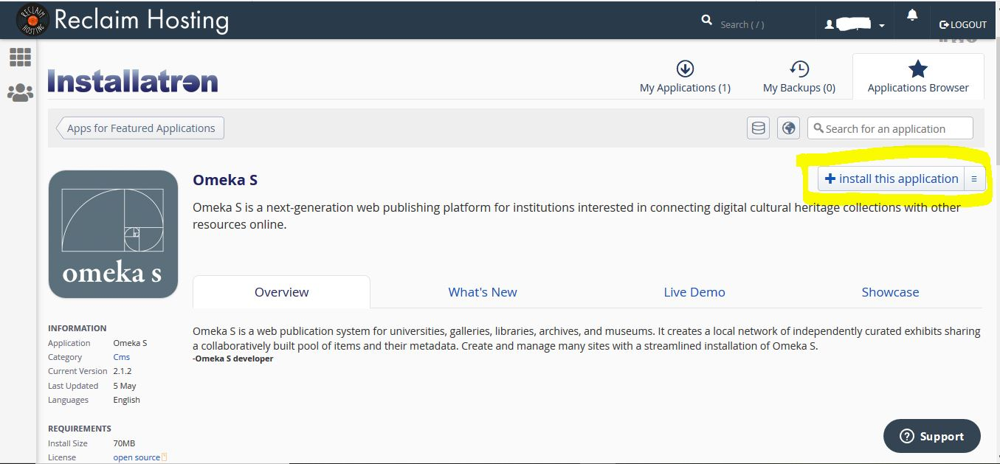

5. כעת יש לבחור דומיין עבור ההתקנה של אומקה, שם לאתר של אומקה, שם משתמש, מייל וססמא שישמשו את המנהל (אתם) בכניסה לOMEKA S  (החלונות הרלוונטים מסומנים בתמונה המצורפת). בסיום יש ללחוץ על "install" ולהמתין:
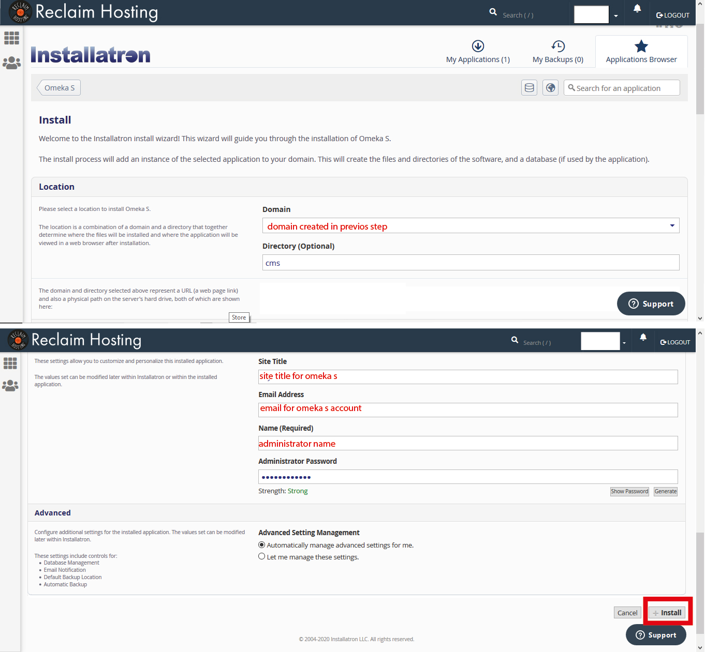

6. בסיום ההתקנה יופיעו שלושה קישורים (מסומנים) השני מביניהם יוביל להתחברות ל "admin dashboard" ותוכלו להתחיל לעבוד עם OMEKA S :
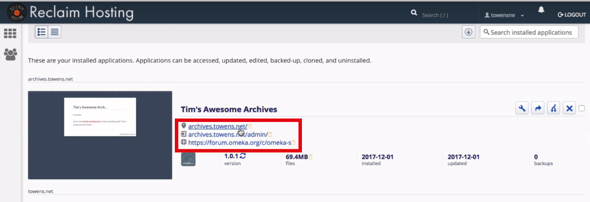

7. בכניסה ל"admin dashboard" תתבקשו להזין את המשתמש והססמא שהזנתם בהתקנה, ותוכלו להיכנס לOMEKA S :
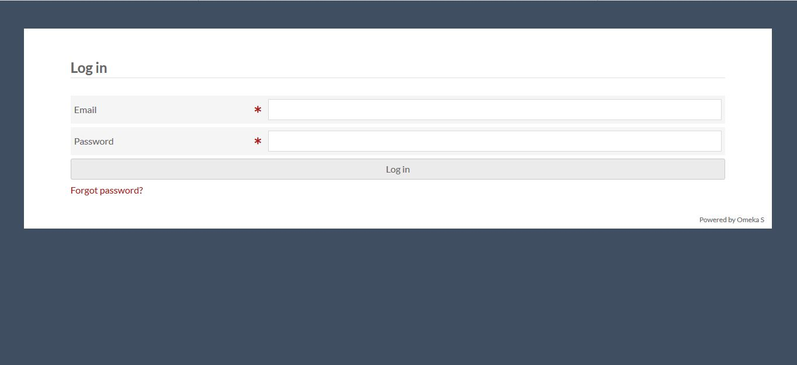
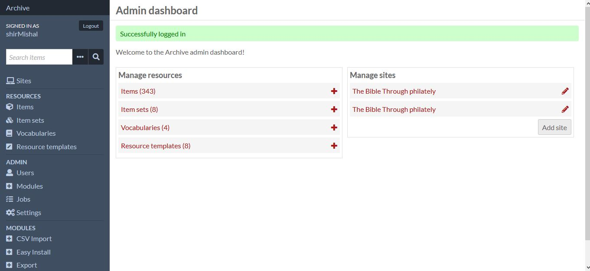


## הוספת מודולים (modules) ותבניות אתר (themes) ל OMEKA S 
OMEKA S מאפשר להתקין הרחבות שמאפשרות כלים נוספים לעבודה או לתצוגה באתר. ההרחבות זמינות בקישור הבא [https://omeka.org/s/modules/](https://omeka.org/s/modules/)  . כמו כן, יש מספר תבניות אפשריות לאתר שזמינות להורדה בקישור [https://omeka.org/s/themes/](https://omeka.org/s/themes/) . תהליך ההתקנה דומה פרט למיקום קבצי ההתקנה.
1. כנסו ל "Cpanel" ולחצו על "Terminal":
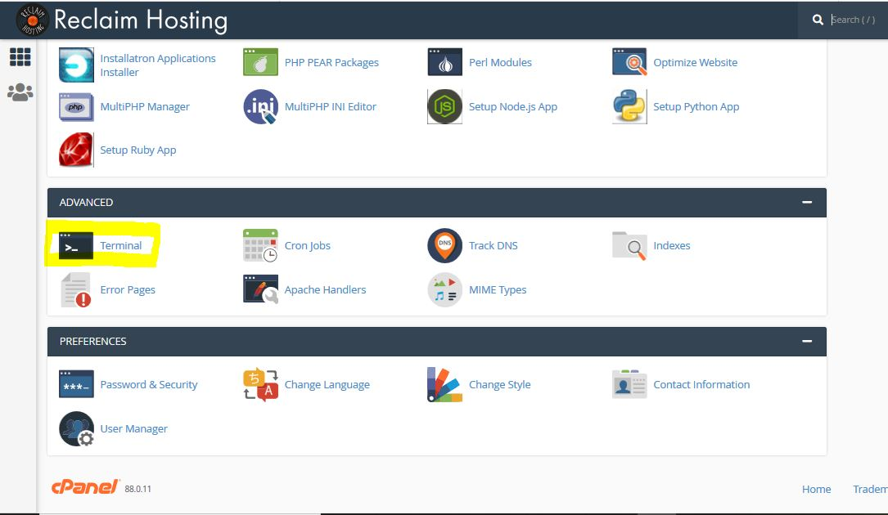

2. בעת ההתקנה של אומקה נוצרה תיקייה בשרת בשם של הדומיין, המכילה תיקיה בשם "modules" ותיקיה בשם "themes". ניתן לראות אותה ואת כל הקבצים והתיקיות שלכם בשרת ע"י כניסה ל "file manager":
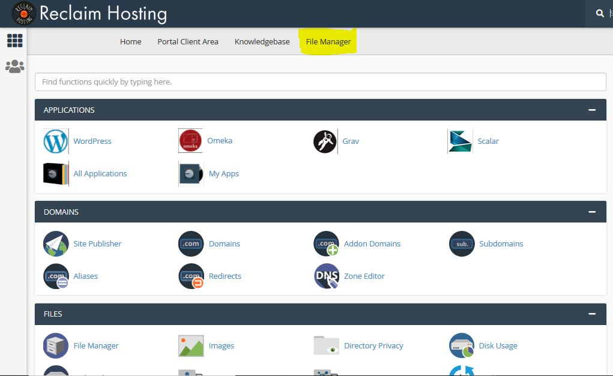
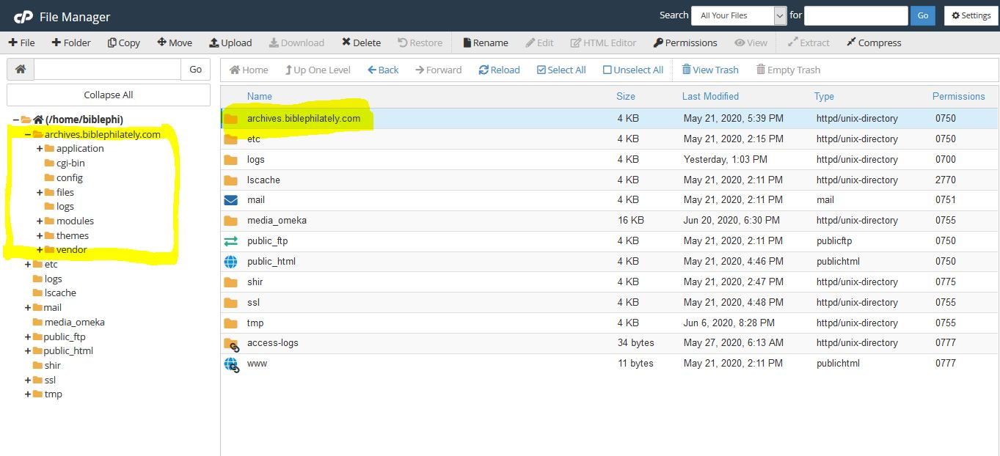

3. כעת בחלון הטרמינל יש לנווט לתיקיה הרצויה, "themes" עבור התקנה של תבנית אתר ו "modules" עבור התקנה של כלים. ניתן לעשות זאת  באמצעות 2 פקודות cd  עם השמות הרלוונטים של התיקיה של הדומיין ואז התיקיה הרצויה:

```markdown
cd yourDomainForOmeka
cd modules
```


לאחר מכן יופיע ה path מעל חלון הterminal (מסומן בצהוב).

4. השתמשו בפקודת  "wget  link_to_module_download" כדי להוריד את ההתוסף הרצוי לתיקיה :

```markdown
wget  https://github.com/omeka-s-modules/Sharing/releases/download/v1.1.0/Sharing-1.1.0.zip
```
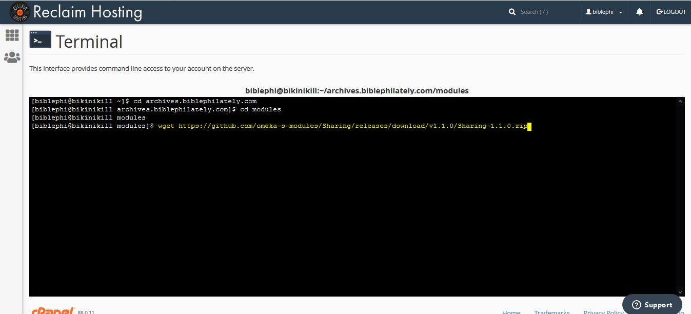

5. השתמשו בפקודת  "unzip name_of_downloaded_file" כדי להוריד את הכיווץ :

```markdown
unzip Sharing-1.1.0.zip
```
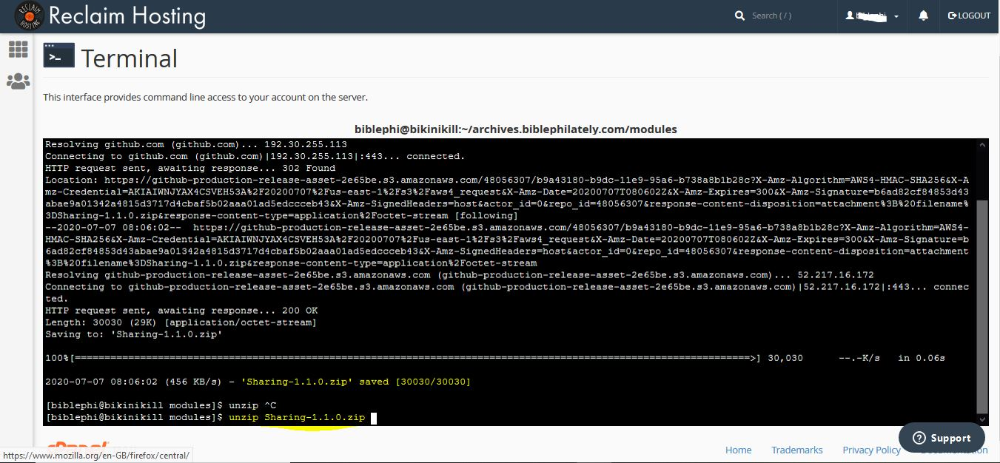

6. כעת היכנסו ל "admin dashboard" ב OMEKA S ולחצו על "Modules":
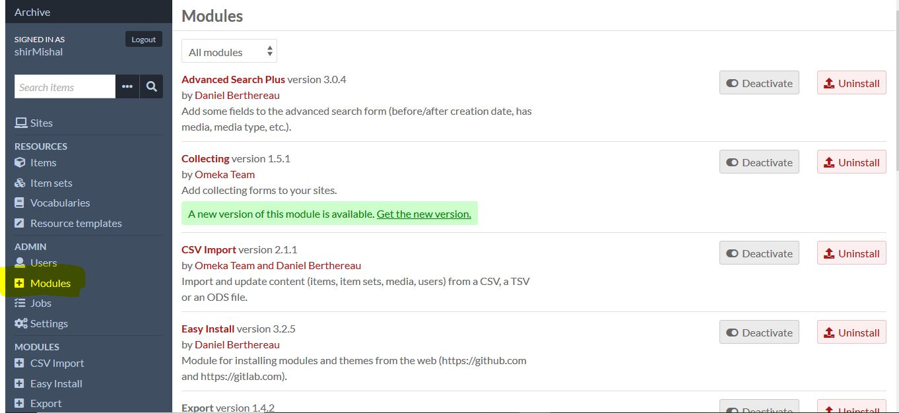

7. במידה והתקנתם "theme"  אין צורך בפעולות נוספות, הוא זמין לכם. במידה והתקנתם "module" יש ללחוץ "install". החל מאותו הרגע הוא זמין לשימוש.
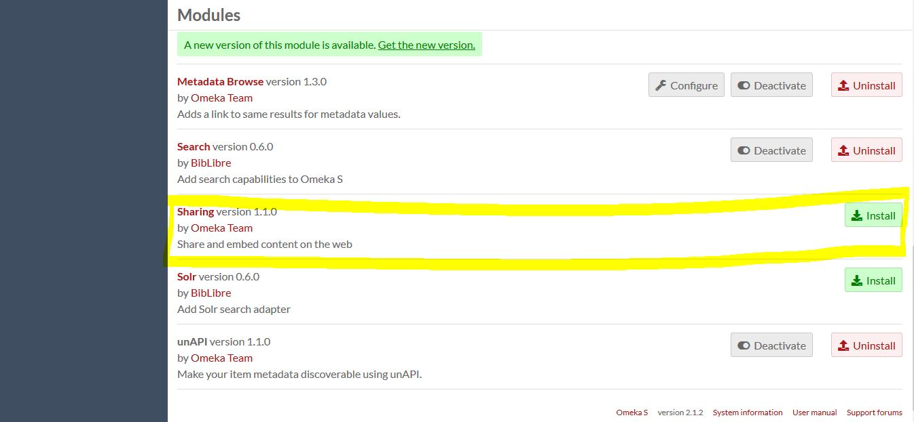

* התהליך של התקנת "theme" זהה פרט לעובדה שעליכם לשים לב שאתם בתיקייה המתאימה.לאחר פקודת "unzip" אין צורך בפעולות נוספות.


## תרגום של [glossary] (https://omeka.org/s/docs/user-manual/glossary/) מתוך ה"user manual" של OMEKA S


## תרגום של: https://omeka.org/s/docs/user-manual/content/resource-template/


## הסבר על בניית קבצי CSV לעבודה עם המודול CSV-IMPORT 
בשלב זה אנו מניחים כי המשתמש כבר עבר תהליך של החלטות לגבי ייצוג הידע ויצר "resource templates" עבור הפריטים בארכיון שלו.
כל ארכיון שנבנה ב OMEKA מכיל פריטים רבים - "items". ב OMEKA S קיים מודול בשם CSV IMPORT שמאפשר יצירת פריטים רבים באופן אוטומטי, ע"י יבוא של קובץ csv. "resource template" זוהי התבנית שמכתיבה את שדות המטה-דאטה של הפריט. תוכן שדה יכול להיות מסוג טקסט (Text), פריט אחר באומקה (Omeka resource), או קישור (URI). ביצירת " resource template" כל שדה במטה-דאטה של הפריט מוגדר ע"י מונח מהסטנדרטים הזמינים באומקה, ניתן לראות אותם בפירוט ב "Vocabularies" בסרגל בצד שמאל:
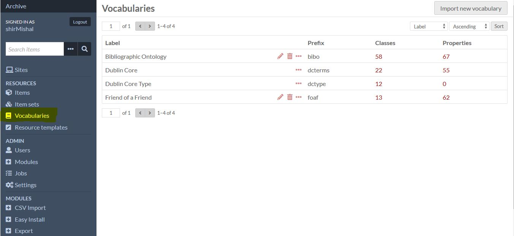

כותרות העמודות ב CSV יכללו את המונח המתאים עבור השדה. ע"י לחיצה על כל אחת מהסטנדרטים ניתן להגיע לפירוט מלא עבור הכותרות שיש להזין. שיוך שמות באופן הזה לעמודות אינו מחייב אבל מקל מאוד על תהליך הייבוא (import) של קובץ csv. בדוגמא מסומנים בצהוב המונחים שהם כותרות אפשריות לעמודות ( השימוש הוא בהתאמה למה שהוגדר בתבנית של הפריטים אותם המשתמש מעוניין לייבא):
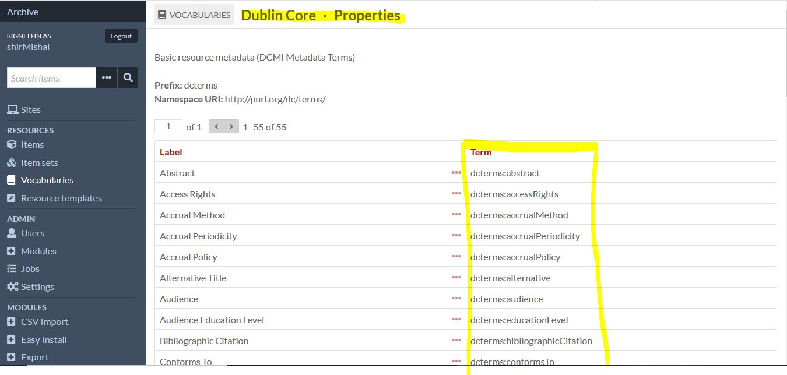

### דוגמא ל "resource template" וקובץ csv תואם:
מתוך אומקה:
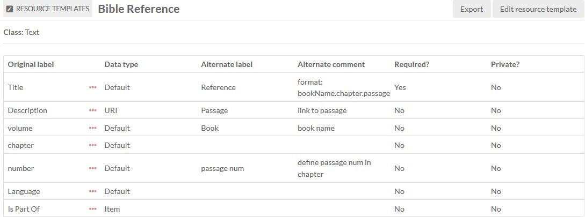
קובץ "json" תואם:
```json
{
    "o:label": "Bible Reference",
    "o:resource_template_property": [
        {
            "o:alternate_label": "Reference",
            "o:alternate_comment": "format: bookName.chapter.passage",
            "o:is_required": true,
            "o:is_private": false,
            "data_type_name": null,
            "data_type_label": null,
            "vocabulary_namespace_uri": "http:\/\/purl.org\/dc\/terms\/",
            "vocabulary_label": "Dublin Core",
            "local_name": "title",
            "label": "Title"
        },
        {
            "o:alternate_label": "Passage",
            "o:alternate_comment": "link to passage",
            "o:is_required": false,
            "o:is_private": false,
            "data_type_name": "uri",
            "data_type_label": "URI",
            "vocabulary_namespace_uri": "http:\/\/purl.org\/dc\/terms\/",
            "vocabulary_label": "Dublin Core",
            "local_name": "description",
            "label": "Description"
        },
        {
            "o:alternate_label": "Book",
            "o:alternate_comment": "book name",
            "o:is_required": false,
            "o:is_private": false,
            "data_type_name": null,
            "data_type_label": null,
            "vocabulary_namespace_uri": "http:\/\/purl.org\/ontology\/bibo\/",
            "vocabulary_label": "Bibliographic Ontology",
            "local_name": "volume",
            "label": "volume"
        },
        {
            "o:alternate_label": null,
            "o:alternate_comment": null,
            "o:is_required": false,
            "o:is_private": false,
            "data_type_name": null,
            "data_type_label": null,
            "vocabulary_namespace_uri": "http:\/\/purl.org\/ontology\/bibo\/",
            "vocabulary_label": "Bibliographic Ontology",
            "local_name": "chapter",
            "label": "chapter"
        },
        {
            "o:alternate_label": "passage num",
            "o:alternate_comment": "define passage num in chapter",
            "o:is_required": false,
            "o:is_private": false,
            "data_type_name": null,
            "data_type_label": null,
            "vocabulary_namespace_uri": "http:\/\/purl.org\/ontology\/bibo\/",
            "vocabulary_label": "Bibliographic Ontology",
            "local_name": "number",
            "label": "number"
        },
        {
            "o:alternate_label": null,
            "o:alternate_comment": null,
            "o:is_required": false,
            "o:is_private": false,
            "data_type_name": null,
            "data_type_label": null,
            "vocabulary_namespace_uri": "http:\/\/purl.org\/dc\/terms\/",
            "vocabulary_label": "Dublin Core",
            "local_name": "language",
            "label": "Language"
        },
        {
            "o:alternate_label": null,
            "o:alternate_comment": null,
            "o:is_required": false,
            "o:is_private": false,
            "data_type_name": "resource:item",
            "data_type_label": "Item",
            "vocabulary_namespace_uri": "http:\/\/purl.org\/dc\/terms\/",
            "vocabulary_label": "Dublin Core",
            "local_name": "isPartOf",
            "label": "Is Part Of"
        }
    ],
    "o:resource_class": {
        "vocabulary_namespace_uri": "http:\/\/purl.org\/dc\/dcmitype\/",
        "vocabulary_label": "Dublin Core Type",
        "local_name": "Text",
        "label": "Text"
    }
}
```
[להורדה כקובץ json לחץ כאן](resources/shir/Bible_Reference.json)

דוגמא לקובץ שניתן לייבא עבור תבנית זו:

|o:is_public|o:owner|dcterms:resource_class|o:resource_template|o:item_set|dcterms:title|dcterms:description|bibo:volume|bibo:chapter|bibo:number|dcterms:bibleVersion|dcterms:language|dcterms:isPartOf|
|:----------|:----------|:----------|:----------|:----------|:----------|:----------------------------|:----------|:----------|:----------|:----------|:----------|:----------|
|1|shirmdesign@gmail.com|Text|Bible Reference|18|Genesis.1.2|https://biblia.com/bible/asv/Ge1.2|Genesis|1|2|ASV|English; Hebrew|40|
|1|shirmdesign@gmail.com|Text|Bible Reference|18|Genesis.1.3|https://biblia.com/bible/asv/Ge1.3|Genesis|1|3|ASV|English; Hebrew|39;41;43|
|1|shirmdesign@gmail.com|Text|Bible Reference|18|Genesis.1.6|https://biblia.com/bible/asv/Ge1.6|Genesis|1|6|ASV|English; Hebrew|42;43|
|1|shirmdesign@gmail.com|Text|Bible Reference|18|Genesis.1.10|https://biblia.com/bible/asv/Ge1.10|Genesis|1|10|ASV|English; Hebrew|44;46|
|1|shirmdesign@gmail.com|Text|Bible Reference|18|Genesis.1.14|https://biblia.com/bible/asv/Ge1.14|Genesis|1|14|ASV|English; Hebrew|44;47;58|
|1|shirmdesign@gmail.com|Text|Bible Reference|18|Genesis.1.20|https://biblia.com/bible/asv/Ge1.20|Genesis|1|20|ASV|English; Hebrew|45;48|
|1|shirmdesign@gmail.com|Text|Bible Reference|18|Genesis.1.27|https://biblia.com/bible/asv/Ge1.27;https://biblia.com/bible/esv/Ge1.27|Genesis|1|27|ASV; ESV|English; Hebrew|45;49|
|1|shirmdesign@gmail.com|Text|Bible Reference|18|Genesis.1-2.|https://biblia.com/bible/asv/Ge1-2|Genesis|1-2||ASV|English; Hebrew|50|
|1|shirmdesign@gmail.com|Text|Bible Reference|18|Deuter.6.21|https://biblia.com/bible/asv/Dt6.21|Deuter|6|21|ESV|English; Hebrew|52;51;88|
|1|shirmdesign@gmail.com|Text|Bible Reference|18|Exodus.14.23|https://biblia.com/bible/asv/Ex14.23|Exodus|14|23|ESV|English; Hebrew|53|

[להורדת הטבלה לחץ כאן](resources/shir/resource_template_example.xlsx)

הסבר מפורט על תהליך העלאה ניתן למצוא בהמשך מדריך זה בפרק המתורגם מתוך ה"user manual" של CSV IMPORT


### עבודה איטרטיבית עם קבצי csv:
במידה ובארכיון שלכם יש פריטים שהמטה-דאטה שלהם מכיל שדה שהתוכן שלו הוא "omeka resource" יש לייצר אותו (resource) בטרם ייצור הפריט. לדוגמא, הגיוני לייצר את כל ה"itemsets" לפני יצירת פריטים ככה שכשניצור פריט ניתן יהיה לשייך אותו לקבוצה. יש לציין כי ניתן לבצע את השיוך גם לאחר שהפריט קיים ולפעמים עבודת בניית הארכיון היא דינמית ככל שמתגלים קשרים נוספים בין דאטה שקיים, אך, התכנון של קבוצות הפריטים הוא חלק מתהליך האיפיון ויאפשר פילטור של פריטים מסויימים בארכיון ולכן מומלץ לתכנן וליצור אותם מראש.  "omeka resource" יכול להיות פריט אחר או למשל קבוצת פריטים "item set". לכל "omeka resource" יש מספר מזהה ייחודי המכונה "omeka id", ובעזרתו ניתן לקשר בין הרשומה של הפריט הנוכחי לפריט אחר או קבוצת פריטים.

על מנת לייבא קבצי csv ולייצר פריטים מסוג זה באופן מלא מומלץ ליצור ולייבא תחילה item sets ובשלב הבא לאפיין את ההיררכיה של הארכיון לפי ה "resource templates" ולעבוד לפי הסדר של התלות. לדוגמא, בארכיון אוסף הבולים שלי יש תבנית עבור אלבום דף ובול. בול הוא חלק מדף, ודף הוא חלק מאלבום. לכן סדר העבודה הנכון הוא ליצור ולייבא את האובייקטים מתבנית אלבום, ליצור ולייבא את האובייקטים מתבנית דף שכל אחד מהם מחזיק שדה עם קישור לאלבום שאליו הוא שייך, ורק בסוף ליצור ולייבא את האובייקטים מתבנית בול שכל אחד מהם מחזיק שדה עם קישור לדף שבו הוא נמצא. לדוגמא רחבה יותר ותרשים המתאר יחסים בין פריטים ניתן לראות בקישור הבא ב"תהליך ונתונים" בסלייד 2:  [למעבר לקישור](https://mishals7.wixsite.com/bible-philately) .

"omeka id" נוצר רק לאחר יצירת הפריטים, אך כדי להצליח לבצע התאמה בין "omeka id" לפריט שהוא שייך אליו, או קבוצת פריטים יש צורך במזהה ייחודי לפריט. המזהה הזה יכול להיות כל שדה שתבחרו במטה-דאטה אך חשוב שיהיה ייחודי. אם אין לכם שדה כזה, המחזיק ערך ייחודי ב "resource template", מומלץ להוסיף כזה תחת ה"term" הבא: "dcterms:identifier".

במהלך בניית קובץ הcsv תחת העמודה שתכיל "omeka resource" יש לכלול ערך ייחודי כלשהו המיוחד לפריט שאותו תרצו להזין כתוכן של השדה. בדוגמא הבאה העמודה "dcterms:isPartOf" מכילה ערך מזהה של פריט מתבנית "page".


## תרגום של: https://omeka.org/s/docs/user-manual/modules/csvimport/


## Welcome to GitHub Pages

You can use the [editor on GitHub](https://github.com/omerdv/Hebrew-guide---Omeka-S/edit/master/index.md) to maintain and preview the content for your website in Markdown files.

Whenever you commit to this repository, GitHub Pages will run [Jekyll](https://jekyllrb.com/) to rebuild the pages in your site, from the content in your Markdown files.

### Markdown

עברית עברית

עברית english עומר

Markdown is a lightweight and easy-to-use syntax for styling your writing. It includes conventions for

```markdown
Syntax highlighted code block

# Header 1
## Header 2
### Header 3

- Bulleted
- List

1. Numbered
2. List

**Bold** and _Italic_ and `Code` text

[Link](url) and 
```


For more details see [GitHub Flavored Markdown](https://guides.github.com/features/mastering-markdown/).

### Jekyll Themes

Your Pages site will use the layout and styles from the Jekyll theme you have selected in your [repository settings](https://github.com/omerdv/Hebrew-guide---Omeka-S/settings). The name of this theme is saved in the Jekyll `_config.yml` configuration file.

### Support or Contact

Having trouble with Pages? Check out our [documentation](https://help.github.com/categories/github-pages-basics/) or [contact support](https://github.com/contact) and we’ll help you sort it out.
