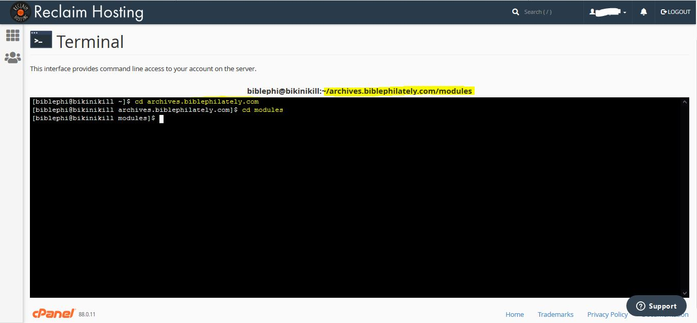

מדריך זה נוצר במסגרת פרוייקט [בקורס מדעי הרוח הדיגיטליים](https://www.cs.bgu.ac.il/~tdh202/Main), בהנחיית דר' יעל נצר, המחלקה למדעי המחשב, אוניברסיטת בן גוריון. 
מטרת המדריך היא להנגיש חלקים מרכזיים במדריך הרחב של OMEKA על מנת לאפשר לחסרי ניסיון והיכרות עם אומקה למידה והתנסות מהירה עם הפלטפורמה.

## התחברות והורדה של OMEKA S ל RECLAIM HOSTING
היכנסו -ל [reclaimhosting](https://reclaimhosting.com), ליחצו על products->shared hosting  והירשמו לשרת במסלול "personal".


לאחר ההרשמה יש להיכנס ל client Area בעזרת מייל משתמש וססמא שהזנתם בעת ההרשמה:


זה דף הבית בכניסה:


כעת, המנוי האישי מאפשר לכם דומיין יחיד, יש ליצור אותו לפני ההתקנה של OMEKA S :
1.  היכנסו ל domains-> Register a New Domain:


2. יש להכניס שם עבור הכתובת הרצויה וללחוץ על check Availability במידה והכתובת פנויה יתאפשר לכם ללחוץ על "continue" :


3. יש לפעול בהמשך ע"פי ההוראות הבסיסיות. בסיום התהליך תוכלו לראות את הדומיין שיצרתם ב "Active Domain" בדף הבית.


כעת, ניתן להתקין את OMEKA S :

1. כנסו ל "Cpanel" מדף הבית:	


2. לחצו על "All Applications":


3. חפשו את "OMEKA S" (קל בעזרת ctrl+f) ולחצו:


4. יש ללחוץ על "install this application":


5. כעת יש לבחור דומיין עבור ההתקנה של אומקה, שם לאתר של אומקה, שם משתמש, מייל וססמא שישמשו את המנהל (אתם) בכניסה לOMEKA S  (החלונות הרלוונטים מסומנים בתמונה המצורפת). בסיום יש ללחוץ על "install" ולהמתין:


6. בסיום ההתקנה יופיעו שלושה קישורים (מסומנים) השני מביניהם יוביל להתחברות ל "admin dashboard" ותוכלו להתחיל לעבוד עם OMEKA S :


7. בכניסה ל"admin dashboard" תתבקשו להזין את המשתמש והססמא שהזנתם בהתקנה, ותוכלו להיכנס לOMEKA S :


## הוספת מודולים (modules) ותבניות אתר (themes) ל OMEKA S 
OMEKA S מאפשר להתקין הרחבות שמאפשרות כלים נוספים לעבודה או לתצוגה באתר. ההרחבות זמינות בקישור הבא [https://omeka.org/s/modules/](https://omeka.org/s/modules/)  . כמו כן, יש מספר תבניות אפשריות לאתר שזמינות להורדה בקישור [https://omeka.org/s/themes/](https://omeka.org/s/themes/) . תהליך ההתקנה דומה פרט למיקום קבצי ההתקנה.
1. כנסו ל "Cpanel" ולחצו על "Terminal":


2. בעת ההתקנה של אומקה נוצרה תיקייה בשרת בשם של הדומיין, המכילה תיקיה בשם "modules" ותיקיה בשם "themes". ניתן לראות אותה ואת כל הקבצים והתיקיות שלכם בשרת ע"י כניסה ל "file manager":


3. כעת בחלון הטרמינל יש לנווט לתיקיה הרצויה, "themes" עבור התקנה של תבנית אתר ו "modules" עבור התקנה של כלים. ניתן לעשות זאת  באמצעות 2 פקודות cd  עם השמות הרלוונטים של התיקיה של הדומיין ואז התיקיה הרצויה:

```markdown
cd yourDomainForOmeka
cd modules
```


לאחר מכן יופיע ה path מעל חלון הterminal (מסומן בצהוב).

4. השתמשו בפקודת  "wget  link_to_module_download" כדי להוריד את ההתוסף הרצוי לתיקיה :

```markdown
wget  https://github.com/omeka-s-modules/Sharing/releases/download/v1.1.0/Sharing-1.1.0.zip
```


5. השתמשו בפקודת  "unzip name_of_downloaded_file" כדי להוריד את הכיווץ :

```markdown
unzip Sharing-1.1.0.zip
```


6. כעת היכנסו ל "admin dashboard" ב OMEKA S ולחצו על "Modules":


7. במידה והתקנתם "theme"  אין צורך בפעולות נוספות, הוא זמין לכם. במידה והתקנתם "module" יש ללחוץ "install". החל מאותו הרגע הוא זמין לשימוש.


* התהליך של התקנת "theme" זהה פרט לעובדה שעליכם לשים לב שאתם בתיקייה המתאימה.לאחר פקודת "unzip" אין צורך בפעולות נוספות.


## תרגום של [glossary] (https://omeka.org/s/docs/user-manual/glossary/) מתוך ה"user manual" של OMEKA S
### מילון מונחים
מילון המונחים שלהלן אמור לעזור בבירור כמה מהמונחים הפחות מוכרים ב-Omeka S. עבור חלק מן המונחים שיוצגו אנו מספקים מונח מקביל בערך מ- Omeka Classic.

כמו כן, שמות המונחים עצמם נשארו באנגלית כפי שהם, ולעיתים הם מופיעים כחלק מההסבר עבור מונחים אחרים. למען הסר ספק, אנו ניתן לכל אחד מן המונחים שיצוינו פה הסבר משל עצמו.

בנוסף, כל המילים המודגשות הן מונחים.

•	**Class**: סוג של משאב, אשר מוגדר ע"י **Vocabulary**. לרוב, **Vocabulary** מצפה לשימוש של **Classes** מסוימים עם **Properties** מסוימים.
לדוגמא, **Class** מסוג foaf:Person לא יהיה בעל **Property** dcterms:publisher (מפרסם).
לעומת זאת, הוא כן יכול להיות בעל **Property** foaf:familyName (שם משפחה).
מונח מקביל מ-Omeka Classic: Item Type

•	**File**: דאטה המועלה ל- **Installation** ומקושר ישירות עם **Item**.
מונח מקביל מ-Omeka Classic: File

•	**Global Admin**: משתמש בעל הרשאות שליטה מלאות בארכיון. לרוב, זהו המשתמש שיצר את הארכיון (מי שיצר את ה- **Installation**).
מונח מקביל מ-Omeka Classic: Superuser

•	**Installation**: מופע התקנה של Omeka S. התקנה זו מכילה **Sites**.

•	**Site**: ארכיון המכיל **Items**. ניתן להתייחס ל-**Site** כאל תיקייה המכילה רשומות. תחת אותו **Installation** יכולים להמצא מס'  **Sites** שונים.

•	**Item**: הרשומות שמהן בנוי ה-**Site**. **Items** ניתנים לשיתוף וזמינים לכל **Site** תחת אותו **Installation**, אלא אם הרשאת שיתוף ה-**Item** בוטלה באופן מפורש.

•	**Item Set**: אוסף של **Items**. **Items** יכולים להשתייך לכל מס' של **Item Sets** בו-זמנית.
מונח מקביל מ-Omeka Classic: Collection, Items with the same tag

•	**Media**: ייצוגים נוספים או תיאורים של **Item**, מעבר למטה דאטה של **Vocabularies**.
בדרך כלל, מתייחס ל-**File**(מכל סוג, כולל טקסט או html), אך יכול גם להתייחס למקור data חיצוני כדוגמת סרטון Youtube, מצגת וכדומה.

•	**Property**: סוג של מטה דאטה מוגדר המתאר תכונה כלשהי של משאב / **Item** מסוים.
למשל, אחד ה-**Properties** הנפוצים הוא dcterms:title, המתאר את הכותרת הראשית המתארת **Item** מסוים. ערכי ה-**Property** יכולים להיות טקסט, משאב של Omeka S, או לינק Url לאתר חיצוני המכיל מידע מסויים.
מונח מקביל מ-Omeka Classic: Element

•	**Resource Template**: סט **Properties** מוגדר מראש, ו-**Class** (אופציונאלי בלבד), אשר מנחה אותנו בעת יצירת **Items** חדשים בעלי **Properties** מוגדרים מראש.
לדוגמא, נוכל ליצור **Resource Template** בשם foaf:Person, אשר באמצעותו נוכל ליצור **Items** מסוג (**Class**) foaf:Person, בעלי **Properties** מוגדר מראש (foaf: properties).

•	**Site Admin**: משתמש בעל הרשאות שליטה מלאות ב-**Site**** ספציפי השייך ל-**Installation** כלשהו (באופן שונה מ-**Global Admin** בעל הרשאות השליטה בכל ה-**Sites** הקיימים ב- **Installation**.
מונח מקביל מ-Omeka Classic: Superuser role

•	**Value**: הערך שבפועל קיים עבור משאב או **Property** מסוים.
לדוגמא, אם **Item** מסוים הוא בעל ה- **Property** dcterms:title (כותרת של **Item**), אזי ערך אפשרי (**Value**) עבור תכונה זו יכול להיות למשל “Heart of Darkness”. ערכים נוספים יכולים להכיל גם מידע על השפה שבה מבוטא הערך. ערכים יכולים גם להיות משאבים או URI למידע חיצוני (למשל URI שמחזיר דאטה מסוג RDF).

•	**Vocabulary**: אוסף מטה דאטה של **Class** ו-**Properties**, (לרוב מיוצג ע"י קובץ מפורמט RDF), אשר נועד לתאר משאב מסוים. אוספים אלו קיימים ונוצרים באופן חיצוני ע"י Omeka, והם ניתנים ליבוא (תחת הגבלות מסוימות) לתוך Omeka S, במהלך תהליך ההתקנה.
אחד ה-**Vocabularies** הנפוצים ביותר הוא Dublin Core Terms (או בקיצור, dcterms).
מונח מקביל מ-Omeka Classic: Element Set


## תרגום של: https://omeka.org/s/docs/user-manual/content/resource-template/
### תבנית משאב (Resource Template)
**Resource Template** הוא סט **Properties** מוגדר מראש, ו-**Class** (אופציונאלי בלבד), אשר מנחה אותנו בעת יצירת **Items** חדשים בעלי **Properties** מוגדרים מראש (ראה דוגמת שימוש במילון המונחים).

**Resource Templates** מנוהלים ע"י ה-**Admin Dashboard** , אליו ניתן להגיע דרך תפריט המשתמש (ממוקם בצד שמאל של המסך), תחת הטאב **Resource Templates**.


מצד שמאל למעלה (מסומן בירוק) מצוין מס' דפי ה-items  הקיימים (כל רשומה בטבלה היאResource Template) , עם כפתורי מעבר בין הדפים. ניתן לעבור בין הדפים ע"י שימוש בחצים או ע"י כתיבת מס' הדף הרצוי (צריך להיות בטווח האפשרי, למשל בדוגמא זו בין 1 ל-22) ולאחר מכן לחיצה על מקש Enter.

מצד ימין למעלה (מסומן בכחול) יש שני תפריטי drop-down, שמאפשרים לנו למיין את ה-Resource TADemplates. ניתן למיין לפי כל אחד מארבעת העמודות:
(מס' ה-items של ה-Resource) Label, Class, Owner, Items 
בסדר עולה (Ascending  ) או יורד (Descending  ). 

ניתן להשתמש באחד משלושת האייקונים (מסומן בכתום) כדי לבצע פעולות שונות על הרשומות:

•	עריכה (עיפרון)

•	מחיקה (פח)

•	הצגת פרטים (שלוש נקודות)

בנוסף, לחיצה על מס' ה-Items של רשומה כלשהי (העמודה הימנית ביותר) תציג לנו רשימה של ה-Items המשויכים לאותה רשומה.

הקישור הבא הינו סרטון המציג יצירה, שימוש ויישום של Resource Templates:

•	[Omeka S Resource Templates](https://vimeo.com/290924872)

### משאב בסיסי (Base Resource)
כל אחד מה- Omeka S Installation מכיל גם תבנית משאב בסיסי אשר מכיל את כל שדות המטה דאטה הדרושים ע"י ה- DPLA ( Digital Public Library of America ). תבנית זו תוצג בטבלת ה- Resource Templates ע"י רשומה בעלת ערך שדה ה- Label: "Base Resource" וללא בעלים (שדה Owner ריק).


**תבנית המשאב הבסיסי מכיל את השדות הבאים (לפי פורמט Dublin Core):**

Title- כותרת,  Rights- זכויות, Type- סוג, Creator- יוצר,  Date- תאריך,  Description- תיאור, Format- פורמט, Language- שפה, Spatial Coverage(Place) – מקום, Publisher- מפרסם, Alternative Title- כותרת חלופית, Contributor- תורם/תומך, Extent- היקף, Identifier- מזהה, Relation- יחס, Is Replaced By- מוחלף על ידי, Replaces- מחליף, RightsHolder- בעל זכויות, Subject- נושא, Temporal Coverage- כיסוי זמני.

### יצירת תבנית משאב חדשה
ע"י לחיצה על הכפתור Add new resource template הנמצא תחת הטאב Resource Templates שנמצא ב- Admin Dashboard, נגיע לחלון יצירת תבנית משאב חדשה:

עמוד יצירת תבנית משאב החדשה מאפשר לנו לבחור Label,  Class, תכונות (Properties) Title ו-Description (dcterms:title ו- dcterms:description בהתאמה) עבור המשאב החדש.


1)	תחת שדה ה- Label, ניתן להקליד את שם ה-Label של המשאב החדש.

2)	ניתן לבחור Class למשאב מתוך רשימה מוגדרת מראש (בחירת Class למשאב היא אופציונלית).

3)	הוספת Properties מתבצעת ע"י תפריט ה-Vocabularies המופיע בצד ימין (מסומן בכחול). ניתן לסנן Properties לפי שם ע"י הקלדה לתיבת הטקסט. כמו כן ניתן לבחור Property ספציפי מתוך אחד מה-Vocabularies ע"י לחיצה על אייקון החץ של אותו Vocabulary ובחירת ה-Property הרצוי.

4)	במידת הצורך ניתן לערוך Property (ראה הסבר למטה על אפשרויות של תכונות).

**שימו לב לשמור את התבנית החדשה (ע"י לחיצה על הכפתור Add- מסומן בירוק) לפני עזיבת העמוד**

### אפשרויות של תכונות (Property Options)
ברשותנו לבצע עריכה של תכונות תבנית משאב קיים כבר: ניתן לשנות Label, לשנות הערה על ה-Label, בחירת Property חדש של המשאב לפי הצורך, וכמו כן קביעת סוג הדאטה עבור כל אחד מה-Properties של התבנית.

לשם כך, במסך ה- Resource Templates, על מנת לערוך רשומת תבנית משאב כלשהי, נלחץ על אייקון העיפרון (אשר הוצג כבר מקודם). תפתח לנו חלונית בצד ימין אשר תאפשר לנו לערוך את השינויים שנרצה:


__*Label*__

שינוי ה-Label  הנוכחי (מסומן בכחול) ע"י כתיבת ה-Label החדש לתיבת הטקסט (Alternate).

__*Comment*__

שינוי ההערה הנוכחית (מסומן בירוק) ע"י כתיבת ההערה החדשה לתיבת הטקסט (Alternate).

__*Other options*__

סדרת אפשריות נוספות לשינוי Properties של תבנית המשאב:

1)	Use for resource title  – אם מסומן, מאפשר בחירת Property שישרת ככותרת של המשאב, במקום האופציה הדיפולטיבית (dcterms:title). Property זה יוצג כערך שדה ה-Title.

2)	Use for resource description – אם מסומן, מאפשר בחירת Property שישרת כתיאור המשאב, במקום האופציה הדיפולטיבית (dcterms:description).


3)	Required – אם מסומן, תהיה חובת שימוש ב-Property כאשר יש שימוש בתבנית המשאב.

4)	Private  – אם מסומן, כל ערך שנוסף ע"י המשתמש עבור Property זה יהיה נגיש וקריא רק עבור הבעלים של ה-item  או ה-item set, אדמינים גלובליים (global administrators), אדמינים מקומיים (site administrators) ועורכים (editors). 
            הערה: משתמשים אשר משתמשים בתבנית המשאב יוכלו לשנות אופציה זו לפי הצורך

5)	Data type – תפריט dropdown אשר באמצעותו אנו יכולים לקבוע את סוג הדאטה של Property:
Literal, URI, Resource (פירוט למטה).
סוג הדאטה הנבחר יחייב את המשתמשים בתבנית המשאב לתת ערך בעל סוג דאטה זה בדיוק עבור ה-Property.

•	Literal: טקסט ו/או html

•	URI: לינק עם Label

•	Resource: Item קיים או Item set המגיע עם ה- Omeka S Installation.

•	ניתן להוסיף אופציות נוספות ע"י שימוש בחבילות עזר, כדוגמת Numeric Data Types  ו-  Value Suggest.

**הערה: חובה ללחוץ על הכפתור Set changes  למטה (מסומן בכתום) על מנת לשמור את השינויים של ה-Property שערכנו, לפני סגירת החלונית או מעבר להצגת Property אחר! אחרת, השינויים ימחקו ולא ישמרו.**

•	משתמשים אשר ישתמשו בתבנית משאב בעת יצירת item חדש עדיין יוכלו להוסיף ל-item עוד properties אחרים, והם ידרשו למלא (לתת ערך) רק ל-properties אשר יוצר התבנית סימן כ- Required.

### עריכת תבניות משאב
לאחר יצירת תבנית משאב חדשה, אנו יכולים לערוך אותה בכל זמן שנרצה ע"י לחיצה על אייקון לחצן העריכה (edit) בטבלת ה- Resource Templates, או ע"י לחיצה על Edit בצד ימין למעלה כאשר אנו צופים כבר ב-Resource Template כלשהו.

אם אנו מחליטים בסוף שאין ברצוננו לערוך את תבנית המשאב, ולוותר על שמירת השינויים שביצענו, ניתן פשוט ללחוץ על כפתור ה-Cancel מצד ימין למעלה (מסומן בכחול). 


### צפייה בתבניות משאב
לחיצה על כותרת תבנית משאב כלשהי מטבלת ה-Resource Templates תפתח בפנינו תצוגת טבלה של כל ה-Properties ו-Property options עבור תבנית משאב זו.


כל אחד מה-Properties מוצג בשורה נפרדת בטבלה, עם העמודות הבאות:

•	Original label- הכותרת המקורית + כפתור "שלוש נקודות" אשר לחיצה עליו תציג לנו את ה-Vocabulary, ערך (term) והערה מקורית של ה-property.

•	Data type- סוג דאטה

•	Alternate label- label חלופי

•	Alternate comment- הערה חלופית

•	האם ה-property  הינו נדרש בעת שימוש בתבנית (נקבע לפי אופציית ה-Required)

•	האם הדאטה של ה-property מוגדר להיות במצב פרטי (נקבע לפי אופציית ה-Private)

בנוסף, ניתן לייצא או לערוך את תבנית המשאב ע"י לחיצה על הכפתורים Export ו- Edit resource template הנמצאים בצד ימין למעלה (מסומן בכחול).

### שיתוף תבניות משאב
באפשרותנו לשתף תבניות משאב בין מופעי התקנות שונות (Omeka S Installations שונות) ע"י ייצוא וייבוא של תבניות אלו.

__*ייצוא תבנית משאב*__

על מנת לייצא תבנית משאב מההתקנה שלנו יש לבצע:

1)	פתיחת תפריט ה- Resource Templates (ישנו כפתור מתאים במסך הראשי של ההתקנה).

2)	לחיצה על ה-Label של תבנית המשאב שאותה נרצה לייצא

3)	בעמוד צפייה בתבנית המשאב עבור ה- Label הנבחר לייצוא (יפתח לנו בעת לחיצה על ה-Label),
עלינו ללחוץ על כפתור הייצוא Export אשר נמצא בצד ימין למעלה


•	ייצוא תבנית משאב באופן שתואר תוריד למחשב שלנו **קובץ json בעל אותו שם של תבנית המשאב לייצוא**. נוכל לחלוק את תבנית המשאב הזו ע"י שליחת הקובץ הנ"ל ושימוש בו בעת ייבוא אצל התקנת Omeka S אחרת.

__*ייבוא תבנית משאב*__

על מנת לייבא תבנית משאב (אשר יוצאה עבורנו לקובץ json מתאים כפי שתואר בתהליך ייצוא תבנית) אל התקנת ה- Omeka S שלנו, יש לבצע:

1)	פתיחת תפריט ה- Resource Templates (ישנו כפתור מתאים במסך הראשי של ההתקנה).

2)	לחיצה על כפתור ה- Import (ייבוא) אשר נמצא בצד ימין למעלה


3)	בעמוד ייבוא ה-Resource Template שיפתח לנו, יש ללחוץ על הכפתור Choose File.
לחיצה על כפתור זה תפתח לנו חלונית בחירת קובץ רצוי של תבנית לייבוא מהמחשב שלנו.
יש לבחור בקובץ json תקין של תבנית מיוצאת.

4)	כעת יש ללחוץ על הכפתור Review Import על מנת לפתוח את עמוד סקירת הייבוא:

   •בעמוד הסקירה, נוכל לבדוק שה-properties וה- property options הם תקינים ומתאימים לנו

   •תבניות מיובאות אשר השתמשו בחבילות עזר לשם הרחבת ה- property options (כגון Value Suggest או Custom Vocabulary) יציינו בעבורנו בעמודת סוג הדאטה מהו ערך המקור שהיה ללא שימוש בחבילות עזר אלו. נוכל לשנות ערך זה על ידי שימוש בתפריט dropdown במידת הצורך (אם לא מותקנות לנו חבילות עזר אלו, נוכל לבחור רק מהערכים האפשריים הדיפולטיבים).


הערה**: אם ברצוננו לייבא תבנית משאב אשר משתמשת ב**-Custom Vocabulary, יש צורך לבצע יצירה ידנית של ה- Vocabulary המיוחד הזה בהתקנה שלנו **לפני** ביצוע תהליך ייבוא תבנית משאב זו.


## הסבר על בניית קבצי CSV לעבודה עם המודול CSV-IMPORT 
בשלב זה אנו מניחים כי המשתמש כבר עבר תהליך של החלטות לגבי ייצוג הידע ויצר "resource templates" עבור הפריטים בארכיון שלו.
כל ארכיון שנבנה ב OMEKA מכיל פריטים רבים - "items". ב OMEKA S קיים מודול בשם CSV IMPORT שמאפשר יצירת פריטים רבים באופן אוטומטי, ע"י יבוא של קובץ csv. "resource template" זוהי התבנית שמכתיבה את שדות המטה-דאטה של הפריט. תוכן שדה יכול להיות מסוג טקסט (Text), פריט אחר באומקה (Omeka resource), או קישור (URI). ביצירת " resource template" כל שדה במטה-דאטה של הפריט מוגדר ע"י מונח מהסטנדרטים הזמינים באומקה, ניתן לראות אותם בפירוט ב "Vocabularies" בסרגל בצד שמאל:


כותרות העמודות ב CSV יכללו את המונח המתאים עבור השדה. ע"י לחיצה על כל אחת מהסטנדרטים ניתן להגיע לפירוט מלא עבור הכותרות שיש להזין. שיוך שמות באופן הזה לעמודות אינו מחייב אבל מקל מאוד על תהליך הייבוא (import) של קובץ csv. בדוגמא מסומנים בצהוב המונחים שהם כותרות אפשריות לעמודות ( השימוש הוא בהתאמה למה שהוגדר בתבנית של הפריטים אותם המשתמש מעוניין לייבא):


### דוגמא ל "resource template" וקובץ csv תואם:
מתוך אומקה:

קובץ "json" תואם:
```json
{
    "o:label": "Bible Reference",
    "o:resource_template_property": [
        {
            "o:alternate_label": "Reference",
            "o:alternate_comment": "format: bookName.chapter.passage",
            "o:is_required": true,
            "o:is_private": false,
            "data_type_name": null,
            "data_type_label": null,
            "vocabulary_namespace_uri": "http:\/\/purl.org\/dc\/terms\/",
            "vocabulary_label": "Dublin Core",
            "local_name": "title",
            "label": "Title"
        },
        {
            "o:alternate_label": "Passage",
            "o:alternate_comment": "link to passage",
            "o:is_required": false,
            "o:is_private": false,
            "data_type_name": "uri",
            "data_type_label": "URI",
            "vocabulary_namespace_uri": "http:\/\/purl.org\/dc\/terms\/",
            "vocabulary_label": "Dublin Core",
            "local_name": "description",
            "label": "Description"
        },
        {
            "o:alternate_label": "Book",
            "o:alternate_comment": "book name",
            "o:is_required": false,
            "o:is_private": false,
            "data_type_name": null,
            "data_type_label": null,
            "vocabulary_namespace_uri": "http:\/\/purl.org\/ontology\/bibo\/",
            "vocabulary_label": "Bibliographic Ontology",
            "local_name": "volume",
            "label": "volume"
        },
        {
            "o:alternate_label": null,
            "o:alternate_comment": null,
            "o:is_required": false,
            "o:is_private": false,
            "data_type_name": null,
            "data_type_label": null,
            "vocabulary_namespace_uri": "http:\/\/purl.org\/ontology\/bibo\/",
            "vocabulary_label": "Bibliographic Ontology",
            "local_name": "chapter",
            "label": "chapter"
        },
        {
            "o:alternate_label": "passage num",
            "o:alternate_comment": "define passage num in chapter",
            "o:is_required": false,
            "o:is_private": false,
            "data_type_name": null,
            "data_type_label": null,
            "vocabulary_namespace_uri": "http:\/\/purl.org\/ontology\/bibo\/",
            "vocabulary_label": "Bibliographic Ontology",
            "local_name": "number",
            "label": "number"
        },
        {
            "o:alternate_label": null,
            "o:alternate_comment": null,
            "o:is_required": false,
            "o:is_private": false,
            "data_type_name": null,
            "data_type_label": null,
            "vocabulary_namespace_uri": "http:\/\/purl.org\/dc\/terms\/",
            "vocabulary_label": "Dublin Core",
            "local_name": "language",
            "label": "Language"
        },
        {
            "o:alternate_label": null,
            "o:alternate_comment": null,
            "o:is_required": false,
            "o:is_private": false,
            "data_type_name": "resource:item",
            "data_type_label": "Item",
            "vocabulary_namespace_uri": "http:\/\/purl.org\/dc\/terms\/",
            "vocabulary_label": "Dublin Core",
            "local_name": "isPartOf",
            "label": "Is Part Of"
        }
    ],
    "o:resource_class": {
        "vocabulary_namespace_uri": "http:\/\/purl.org\/dc\/dcmitype\/",
        "vocabulary_label": "Dublin Core Type",
        "local_name": "Text",
        "label": "Text"
    }
}
```
[להורדה כקובץ json לחץ כאן](resources/shir/Bible_Reference.json)

דוגמא לקובץ שניתן לייבא עבור תבנית זו:

|o:is_public|o:owner|dcterms:resource_class|o:resource_template|o:item_set|dcterms:title|dcterms:description|bibo:volume|bibo:chapter|bibo:number|dcterms:bibleVersion|dcterms:language|dcterms:isPartOf|
|:----------|:----------|:----------|:----------|:----------|:----------|:----------------------------|:----------|:----------|:----------|:----------|:----------|:----------|
|1|shirmdesign@gmail.com|Text|Bible Reference|18|Genesis.1.2|https://biblia.com/bible/asv/Ge1.2|Genesis|1|2|ASV|English; Hebrew|40|
|1|shirmdesign@gmail.com|Text|Bible Reference|18|Genesis.1.3|https://biblia.com/bible/asv/Ge1.3|Genesis|1|3|ASV|English; Hebrew|39;41;43|
|1|shirmdesign@gmail.com|Text|Bible Reference|18|Genesis.1.6|https://biblia.com/bible/asv/Ge1.6|Genesis|1|6|ASV|English; Hebrew|42;43|
|1|shirmdesign@gmail.com|Text|Bible Reference|18|Genesis.1.10|https://biblia.com/bible/asv/Ge1.10|Genesis|1|10|ASV|English; Hebrew|44;46|
|1|shirmdesign@gmail.com|Text|Bible Reference|18|Genesis.1.14|https://biblia.com/bible/asv/Ge1.14|Genesis|1|14|ASV|English; Hebrew|44;47;58|
|1|shirmdesign@gmail.com|Text|Bible Reference|18|Genesis.1.20|https://biblia.com/bible/asv/Ge1.20|Genesis|1|20|ASV|English; Hebrew|45;48|
|1|shirmdesign@gmail.com|Text|Bible Reference|18|Genesis.1.27|https://biblia.com/bible/asv/Ge1.27;https://biblia.com/bible/esv/Ge1.27|Genesis|1|27|ASV; ESV|English; Hebrew|45;49|
|1|shirmdesign@gmail.com|Text|Bible Reference|18|Genesis.1-2.|https://biblia.com/bible/asv/Ge1-2|Genesis|1-2||ASV|English; Hebrew|50|
|1|shirmdesign@gmail.com|Text|Bible Reference|18|Deuter.6.21|https://biblia.com/bible/asv/Dt6.21|Deuter|6|21|ESV|English; Hebrew|52;51;88|
|1|shirmdesign@gmail.com|Text|Bible Reference|18|Exodus.14.23|https://biblia.com/bible/asv/Ex14.23|Exodus|14|23|ESV|English; Hebrew|53|

[להורדת הטבלה לחץ כאן](resources/shir/resource_template_example.xlsx)

הסבר מפורט על תהליך העלאה ניתן למצוא בהמשך מדריך זה בפרק המתורגם מתוך ה"user manual" של CSV IMPORT


### עבודה איטרטיבית עם קבצי csv:
במידה ובארכיון שלכם יש פריטים שהמטה-דאטה שלהם מכיל שדה שהתוכן שלו הוא "omeka resource" יש לייצר אותו (resource) בטרם ייצור הפריט. לדוגמא, הגיוני לייצר את כל ה"itemsets" לפני יצירת פריטים ככה שכשניצור פריט ניתן יהיה לשייך אותו לקבוצה. יש לציין כי ניתן לבצע את השיוך גם לאחר שהפריט קיים ולפעמים עבודת בניית הארכיון היא דינמית ככל שמתגלים קשרים נוספים בין דאטה שקיים, אך, התכנון של קבוצות הפריטים הוא חלק מתהליך האיפיון ויאפשר פילטור של פריטים מסויימים בארכיון ולכן מומלץ לתכנן וליצור אותם מראש.  "omeka resource" יכול להיות פריט אחר או למשל קבוצת פריטים "item set". לכל "omeka resource" יש מספר מזהה ייחודי המכונה "omeka id", ובעזרתו ניתן לקשר בין הרשומה של הפריט הנוכחי לפריט אחר או קבוצת פריטים.

על מנת לייבא קבצי csv ולייצר פריטים מסוג זה באופן מלא מומלץ ליצור ולייבא תחילה item sets ובשלב הבא לאפיין את ההיררכיה של הארכיון לפי ה "resource templates" ולעבוד לפי הסדר של התלות. לדוגמא, בארכיון אוסף הבולים שלי יש תבנית עבור אלבום דף ובול. בול הוא חלק מדף, ודף הוא חלק מאלבום. לכן סדר העבודה הנכון הוא ליצור ולייבא את האובייקטים מתבנית אלבום, ליצור ולייבא את האובייקטים מתבנית דף שכל אחד מהם מחזיק שדה עם קישור לאלבום שאליו הוא שייך, ורק בסוף ליצור ולייבא את האובייקטים מתבנית בול שכל אחד מהם מחזיק שדה עם קישור לדף שבו הוא נמצא. לדוגמא רחבה יותר ותרשים המתאר יחסים בין פריטים ניתן לראות בקישור הבא ב"תהליך ונתונים" בסלייד 2:  [למעבר לקישור](https://mishals7.wixsite.com/bible-philately) .

"omeka id" נוצר רק לאחר יצירת הפריטים, אך כדי להצליח לבצע התאמה בין "omeka id" לפריט שהוא שייך אליו, או קבוצת פריטים יש צורך במזהה ייחודי לפריט. המזהה הזה יכול להיות כל שדה שתבחרו במטה-דאטה אך חשוב שיהיה ייחודי. אם אין לכם שדה כזה, המחזיק ערך ייחודי ב "resource template", מומלץ להוסיף כזה תחת ה"term" הבא: "dcterms:identifier".

במהלך בניית קובץ הcsv תחת העמודה שתכיל "omeka resource" יש לכלול ערך ייחודי כלשהו המיוחד לפריט שאותו תרצו להזין כתוכן של השדה. בדוגמא הבאה העמודה "dcterms:isPartOf" מכילה ערך מזהה של פריט מתבנית "page".

|o:is_public|o:owner|dcterms:resource_class|o:resource_template|o:item_set|dcterms:title|dcterms:description|bibo:volume|bibo:chapter|bibo:number|dcterms:bibleVersion|dcterms:language|dcterms:isPartOf|
|:----------|:----------|:----------|:----------|:----------|:----------|:----------|:----------|:----------|:----------|:----------|:----------|:----------|
|1|shirmdesign@gmail.com|Text|Bible Reference|18|Genesis|https://biblia.com/bible/asv/Ge1.2  |Genesis|1|2|ASV|English; Hebrew|05/02|
|1|shirmdesign@gmail.com|Text|Bible Reference|18|Genesis|https://biblia.com/bible/asv/Ge1.3  |Genesis|1|3|ASV|English; Hebrew|05/03|
|1|shirmdesign@gmail.com|Text|Bible Reference|18|Genesis|https://biblia.com/bible/asv/Ge1.3  |Genesis|1|3|ASV|English; Hebrew|05/07|
|1|shirmdesign@gmail.com|Text|Bible Reference|18|Genesis|https://biblia.com/bible/asv/Ge1.6  |Genesis|1|6|ASV|English; Hebrew|05/08|
|1|shirmdesign@gmail.com|Text|Bible Reference|18|Genesis|https://biblia.com/bible/asv/Ge1.3  |Genesis|1|3|ASV|English; Hebrew|05/16|
|1|shirmdesign@gmail.com|Text|Bible Reference|18|Genesis|https://biblia.com/bible/asv/Ge1.6  |Genesis|1|6|ASV|English; Hebrew|05/16|
|1|shirmdesign@gmail.com|Text|Bible Reference|18|Genesis|https://biblia.com/bible/asv/Ge1.10 |Genesis|1|10|ASV|English; Hebrew|05/17|
|1|shirmdesign@gmail.com|Text|Bible Reference|18|Genesis|https://biblia.com/bible/asv/Ge1.14 |Genesis|1|14|ASV|English; Hebrew|05/17|
|1|shirmdesign@gmail.com|Text|Bible Reference|18|Genesis|https://biblia.com/bible/asv/Ge1.20 |Genesis|1|20|ASV|English; Hebrew|05/18|
|1|shirmdesign@gmail.com|Text|Bible Reference|18|Genesis|https://biblia.com/bible/asv/Ge1.27 |Genesis|1|27|ASV|English; Hebrew|05/18|

[להורדת הטבלה לחץ כאן](resources/shir/refs_input.csv)


לאחר בניית המטה-דאטה ניתן לבצע החלפה של השדה המזהה שהזנתם (כתוכן בטבלה) ב "omeka id" ע"י שימוש בAPI של OMEKA S ועבודה עם ספריית pandas לעריכת קבצי csv. 
מצורף כאן קוד בסיסי להתחלה עבור פיתוח. כמו כן מידע נוסף על API של OMEKA S זמין בקישור הבא: [https://omeka.org/s/docs/developer/api/](https://omeka.org/s/docs/developer/api/) .

```python
import os
import io
import sys
import time
import requests
import json
import csv
import pandas

# IMPORTANT NOTE:
# number of items in each response is limited to the number appears in your omeka account at "general setting -> Results per page" so make sure you don't miss items regarding this issue

# RUNNING INSTRUCTIONS:
#   python ./richdataapi.py ./relative_path_to_csvfile/fileName.csv

# code to create dictionary using omeka api {"itemset_name": omeka_id}
id_by_itemSet = {}

def extract_dict_id_by_itemSet(json_object):
    #iterate over response:
    for dict in json_object:
        key = dict['o:title']   # key = title is uniqe value for each itemset
        val = dict['o:id']      # value = omeka id
        id_by_itemSet [key] = val
    return id_by_itemSet

def omekaApiItemSets():
    install_location = "http://site_name.reclaim_hoasting_domain"
    # generate key_identity and key_credential with your omeka acount
    # mor info: https://omeka.org/s/docs/user-manual/admin/users/#api-key
    key_identity = 'put your string here'
    key_credential = 'put your string here'
    endpoint = "{}/api/item_sets?key_identity={}&key_credential={}"
    final_uri = endpoint.format(install_location, key_identity, key_credential)
    headers = {
        'accept': 'application/json'
    }
    try:
        # send question...
        response = requests.get(final_uri, headers=headers)
    except requests.RequestException as e:
        dict(error=str(e))
    # print (response)
    data = response.json()
    # print(data)
    # iterate response and create dictionary
    id_by_itemSet = extract_dict_id_by_itemSet(data)
    print (id_by_itemSet)

# code to get all items in item set by itemset id using omeka api 
# input: itemset id (you should use previous function to get it by itemset name)
# output: response json contained all relevant items
def omekaApiItems(item_set_id):
    install_location = "http://site_name.reclaim_hoasting_domain"
    # generate key_identity and key_credential with your omeka acount
    # mor info: https://omeka.org/s/docs/user-manual/admin/users/#api-key
    key_identity = 'put your string here'
    key_credential = 'put your string here'
    endpoint = "{}/api/items?key_identity={}&key_credential={}&item_set_id={}"
    final_uri = endpoint.format(install_location, key_identity, key_credential, item_set_id)
    headers = {
        'accept': 'application/json'
    }
    try:
        response = requests.get(final_uri, headers=headers)#data={'data': json.dumps(items)},
    except requests.RequestException as e:
        dict(error=str(e))
    return response.json()

# code to exstract dictionary dict {"identifierFieldContent": omeka_id} from omeka API json response
# input: json object 
# output: dictionary with key = "identifierFieldContent" value = omeka_id

def extract_dict_id_pageIdentifier(json_object):    
    for dict in json_object:
        key = dict['dcterms:identifier'][0]['@value']
        val = dict['o:id']
        id_by_identifierField = {} #dict {"identifierFieldContent": omeka_id}
        id_by_identifierField [key] = val
    return id_by_identifierField


# code to edit csvFile and assign omeka id
def editCSV(csvFileName):
    # declare all column titles and ther content type - assign your own columns
    dataTypes={"your_column1_title":"your_column1_type","o:is_public":"string","o:owner":"string","dcterms:resource_class":"string","o:resource_template":"string","o:item_set":"string","dcterms:title":"string","dcterms:description":"string","bibo:volume":"string","bibo:chapter":"string","bibo:number":"string","dcterms:bibleVersion":"string","dcterms:language":"string","dcterms:isPartOf":"string"}
    # open and read csv file 
    df = pandas.read_csv(csvFileName, dtype=dataTypes)
    #build dict page- omeka id
    data = omekaApiItems(id_by_itemSet.get("itemSet_name_here"))
    dict_id_pageIdentifier = extract_dict_id_pageIdentifier(data)
    # iterate over csv rows
    r = len(df.index)
    for i in range(r):
        # if cell at [row,col] is in dictionary as key, assign it's value to that cell. else delete row from table
        if (dict_id_pageIdentifier.get(df.at [i, 'column_title_here']) != None):
            df.at [i, 'column_title_here'] = str(dict_id_pageIdentifier[df.at [i, 'column_title_here']])
        else: # if all is correct this should not happen
            df = df.drop(i)
            print ("row deleted")
    # print df after changes
    print (df)    
    # write df into new csv output file
    df.to_csv(os.path.splitext(os.path.basename(csvFileName))[0]+"_output.csv", index=False) 


#------------------------------------------------------------------------------------------------
# create main to run functions
if __name__ == "__main__":
    # create global variable dictionary using omeka api {"itemset_name": omeka_id}
    omekaApiItemSets()
    # create new csvFile and assign omeka id insted of identifier to another item
    editCSV(sys.argv[1])
```

[להורדת הקוד לחץ כאן](resources/shir/code.py)

[להורדת דוגמאות של קלט ופלט לחץ כאן](resources/shir/input_output_examples.zip)


## תרגום של: https://omeka.org/s/docs/user-manual/modules/csvimport/


## Welcome to GitHub Pages

You can use the [editor on GitHub](https://github.com/omerdv/Hebrew-guide---Omeka-S/edit/master/index.md) to maintain and preview the content for your website in Markdown files.

Whenever you commit to this repository, GitHub Pages will run [Jekyll](https://jekyllrb.com/) to rebuild the pages in your site, from the content in your Markdown files.

### Markdown

עברית עברית

עברית english עומר

Markdown is a lightweight and easy-to-use syntax for styling your writing. It includes conventions for

```markdown
Syntax highlighted code block

# Header 1
## Header 2
### Header 3

- Bulleted
- List

1. Numbered
2. List

**Bold** and _Italic_ and `Code` text

[Link](url) and 
```


For more details see [GitHub Flavored Markdown](https://guides.github.com/features/mastering-markdown/).

### Jekyll Themes

Your Pages site will use the layout and styles from the Jekyll theme you have selected in your [repository settings](https://github.com/omerdv/Hebrew-guide---Omeka-S/settings). The name of this theme is saved in the Jekyll `_config.yml` configuration file.

### Support or Contact

Having trouble with Pages? Check out our [documentation](https://help.github.com/categories/github-pages-basics/) or [contact support](https://github.com/contact) and we’ll help you sort it out.
