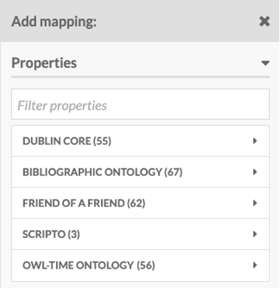
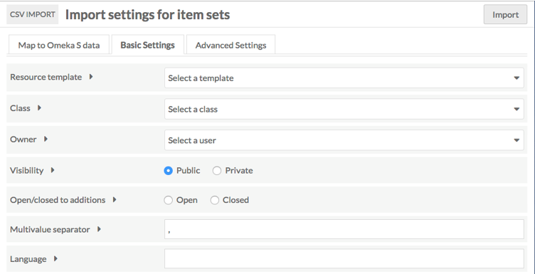
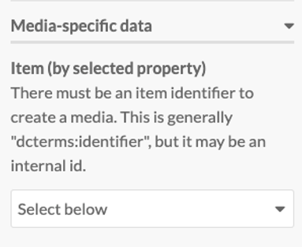
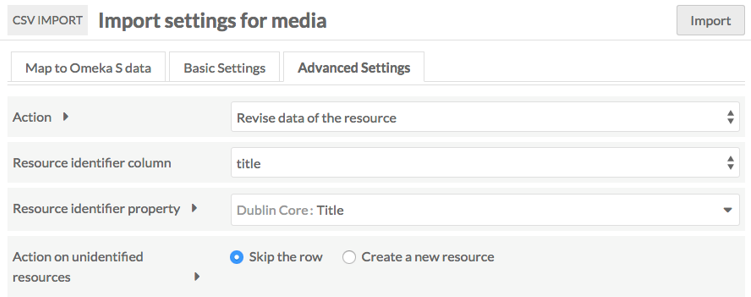

מדריך זה נוצר במסגרת פרוייקט [בקורס מדעי הרוח הדיגיטליים](https://www.cs.bgu.ac.il/~tdh202/Main), בהנחיית דר' יעל נצר, המחלקה למדעי המחשב, אוניברסיטת בן גוריון. 
מטרת המדריך היא להנגיש חלקים מרכזיים במדריך הרחב של OMEKA על מנת לאפשר לחסרי ניסיון והיכרות עם אומקה למידה והתנסות מהירה עם הפלטפורמה.

## התחברות והורדה של OMEKA S ל RECLAIM HOSTING
היכנסו -ל [reclaimhosting](https://reclaimhosting.com), ליחצו על products->shared hosting  והירשמו לשרת במסלול "personal".


לאחר ההרשמה יש להיכנס ל client Area בעזרת מייל משתמש וססמא שהזנתם בעת ההרשמה:


זה דף הבית בכניסה:


כעת, המנוי האישי מאפשר לכם דומיין יחיד, יש ליצור אותו לפני ההתקנה של OMEKA S :
1.  היכנסו ל domains-> Register a New Domain:


2. יש להכניס שם עבור הכתובת הרצויה וללחוץ על check Availability במידה והכתובת פנויה יתאפשר לכם ללחוץ על "continue" :


3. יש לפעול בהמשך ע"פי ההוראות הבסיסיות. בסיום התהליך תוכלו לראות את הדומיין שיצרתם ב "Active Domain" בדף הבית.


כעת, ניתן להתקין את OMEKA S :

1. כנסו ל "Cpanel" מדף הבית:	


2. לחצו על "All Applications":


3. חפשו את "OMEKA S" (קל בעזרת ctrl+f) ולחצו:


4. יש ללחוץ על "install this application":


5. כעת יש לבחור דומיין עבור ההתקנה של אומקה, שם לאתר של אומקה, שם משתמש, מייל וססמא שישמשו את המנהל (אתם) בכניסה לOMEKA S  (החלונות הרלוונטים מסומנים בתמונה המצורפת). בסיום יש ללחוץ על "install" ולהמתין:


6. בסיום ההתקנה יופיעו שלושה קישורים (מסומנים) השני מביניהם יוביל להתחברות ל "admin dashboard" ותוכלו להתחיל לעבוד עם OMEKA S :


7. בכניסה ל"admin dashboard" תתבקשו להזין את המשתמש והססמא שהזנתם בהתקנה, ותוכלו להיכנס לOMEKA S :


## הוספת מודולים (modules) ותבניות אתר (themes) ל OMEKA S 
OMEKA S מאפשר להתקין הרחבות שמאפשרות כלים נוספים לעבודה או לתצוגה באתר. ההרחבות זמינות בקישור הבא [https://omeka.org/s/modules/](https://omeka.org/s/modules/)  . כמו כן, יש מספר תבניות אפשריות לאתר שזמינות להורדה בקישור [https://omeka.org/s/themes/](https://omeka.org/s/themes/) . תהליך ההתקנה דומה פרט למיקום קבצי ההתקנה.
1. כנסו ל "Cpanel" ולחצו על "Terminal":


2. בעת ההתקנה של אומקה נוצרה תיקייה בשרת בשם של הדומיין, המכילה תיקיה בשם "modules" ותיקיה בשם "themes". ניתן לראות אותה ואת כל הקבצים והתיקיות שלכם בשרת ע"י כניסה ל "file manager":


3. כעת בחלון הטרמינל יש לנווט לתיקיה הרצויה, "themes" עבור התקנה של תבנית אתר ו "modules" עבור התקנה של כלים. ניתן לעשות זאת  באמצעות 2 פקודות cd  עם השמות הרלוונטים של התיקיה של הדומיין ואז התיקיה הרצויה:

```markdown
cd yourDomainForOmeka
cd modules
```


לאחר מכן יופיע ה path מעל חלון הterminal (מסומן בצהוב).

4. השתמשו בפקודת  "wget  link_to_module_download" כדי להוריד את ההתוסף הרצוי לתיקיה :

```markdown
wget  https://github.com/omeka-s-modules/Sharing/releases/download/v1.1.0/Sharing-1.1.0.zip
```


5. השתמשו בפקודת  "unzip name_of_downloaded_file" כדי להוריד את הכיווץ :

```markdown
unzip Sharing-1.1.0.zip
```


6. כעת היכנסו ל "admin dashboard" ב OMEKA S ולחצו על "Modules":


7. במידה והתקנתם "theme"  אין צורך בפעולות נוספות, הוא זמין לכם. במידה והתקנתם "module" יש ללחוץ "install". החל מאותו הרגע הוא זמין לשימוש.


* התהליך של התקנת "theme" זהה פרט לעובדה שעליכם לשים לב שאתם בתיקייה המתאימה.לאחר פקודת "unzip" אין צורך בפעולות נוספות.


## תרגום של [glossary] (https://omeka.org/s/docs/user-manual/glossary/) מתוך ה"user manual" של OMEKA S
### מילון מונחים
מילון המונחים שלהלן אמור לעזור בבירור כמה מהמונחים הפחות מוכרים ב-Omeka S. עבור חלק מן המונחים שיוצגו אנו מספקים מונח מקביל בערך מ- Omeka Classic.

כמו כן, שמות המונחים עצמם נשארו באנגלית כפי שהם, ולעיתים הם מופיעים כחלק מההסבר עבור מונחים אחרים. למען הסר ספק, אנו ניתן לכל אחד מן המונחים שיצוינו פה הסבר משל עצמו.

בנוסף, כל המילים המודגשות הן מונחים.

•	**Class**: סוג של משאב, אשר מוגדר ע"י **Vocabulary**. לרוב, **Vocabulary** מצפה לשימוש של **Classes** מסוימים עם **Properties** מסוימים.
לדוגמא, **Class** מסוג foaf:Person לא יהיה בעל **Property** dcterms:publisher (מפרסם).
לעומת זאת, הוא כן יכול להיות בעל **Property** foaf:familyName (שם משפחה).
מונח מקביל מ-Omeka Classic: Item Type

•	**File**: דאטה המועלה ל- **Installation** ומקושר ישירות עם **Item**.
מונח מקביל מ-Omeka Classic: File

•	**Global Admin**: משתמש בעל הרשאות שליטה מלאות בארכיון. לרוב, זהו המשתמש שיצר את הארכיון (מי שיצר את ה- **Installation**).
מונח מקביל מ-Omeka Classic: Superuser

•	**Installation**: מופע התקנה של Omeka S. התקנה זו מכילה **Sites**.

•	**Site**: ארכיון המכיל **Items**. ניתן להתייחס ל-**Site** כאל תיקייה המכילה רשומות. תחת אותו **Installation** יכולים להמצא מס'  **Sites** שונים.

•	**Item**: הרשומות שמהן בנוי ה-**Site**. **Items** ניתנים לשיתוף וזמינים לכל **Site** תחת אותו **Installation**, אלא אם הרשאת שיתוף ה-**Item** בוטלה באופן מפורש.

•	**Item Set**: אוסף של **Items**. **Items** יכולים להשתייך לכל מס' של **Item Sets** בו-זמנית.
מונח מקביל מ-Omeka Classic: Collection, Items with the same tag

•	**Media**: ייצוגים נוספים או תיאורים של **Item**, מעבר למטה דאטה של **Vocabularies**.
בדרך כלל, מתייחס ל-**File**(מכל סוג, כולל טקסט או html), אך יכול גם להתייחס למקור data חיצוני כדוגמת סרטון Youtube, מצגת וכדומה.

•	**Property**: סוג של מטה דאטה מוגדר המתאר תכונה כלשהי של משאב / **Item** מסוים.
למשל, אחד ה-**Properties** הנפוצים הוא dcterms:title, המתאר את הכותרת הראשית המתארת **Item** מסוים. ערכי ה-**Property** יכולים להיות טקסט, משאב של Omeka S, או לינק Url לאתר חיצוני המכיל מידע מסויים.
מונח מקביל מ-Omeka Classic: Element

•	**Resource Template**: סט **Properties** מוגדר מראש, ו-**Class** (אופציונאלי בלבד), אשר מנחה אותנו בעת יצירת **Items** חדשים בעלי **Properties** מוגדרים מראש.
לדוגמא, נוכל ליצור **Resource Template** בשם foaf:Person, אשר באמצעותו נוכל ליצור **Items** מסוג (**Class**) foaf:Person, בעלי **Properties** מוגדר מראש (foaf: properties).

•	**Site Admin**: משתמש בעל הרשאות שליטה מלאות ב-**Site**** ספציפי השייך ל-**Installation** כלשהו (באופן שונה מ-**Global Admin** בעל הרשאות השליטה בכל ה-**Sites** הקיימים ב- **Installation**.
מונח מקביל מ-Omeka Classic: Superuser role

•	**Value**: הערך שבפועל קיים עבור משאב או **Property** מסוים.
לדוגמא, אם **Item** מסוים הוא בעל ה- **Property** dcterms:title (כותרת של **Item**), אזי ערך אפשרי (**Value**) עבור תכונה זו יכול להיות למשל “Heart of Darkness”. ערכים נוספים יכולים להכיל גם מידע על השפה שבה מבוטא הערך. ערכים יכולים גם להיות משאבים או URI למידע חיצוני (למשל URI שמחזיר דאטה מסוג RDF).

•	**Vocabulary**: אוסף מטה דאטה של **Class** ו-**Properties**, (לרוב מיוצג ע"י קובץ מפורמט RDF), אשר נועד לתאר משאב מסוים. אוספים אלו קיימים ונוצרים באופן חיצוני ע"י Omeka, והם ניתנים ליבוא (תחת הגבלות מסוימות) לתוך Omeka S, במהלך תהליך ההתקנה.
אחד ה-**Vocabularies** הנפוצים ביותר הוא Dublin Core Terms (או בקיצור, dcterms).
מונח מקביל מ-Omeka Classic: Element Set


## תרגום של: https://omeka.org/s/docs/user-manual/content/resource-template/
### תבנית משאב (Resource Template)
**Resource Template** הוא סט **Properties** מוגדר מראש, ו-**Class** (אופציונאלי בלבד), אשר מנחה אותנו בעת יצירת **Items** חדשים בעלי **Properties** מוגדרים מראש (ראה דוגמת שימוש במילון המונחים).

**Resource Templates** מנוהלים ע"י ה-**Admin Dashboard** , אליו ניתן להגיע דרך תפריט המשתמש (ממוקם בצד שמאל של המסך), תחת הטאב **Resource Templates**.


מצד שמאל למעלה (מסומן בירוק) מצוין מס' דפי ה-items  הקיימים (כל רשומה בטבלה היאResource Template) , עם כפתורי מעבר בין הדפים. ניתן לעבור בין הדפים ע"י שימוש בחצים או ע"י כתיבת מס' הדף הרצוי (צריך להיות בטווח האפשרי, למשל בדוגמא זו בין 1 ל-22) ולאחר מכן לחיצה על מקש Enter.

מצד ימין למעלה (מסומן בכחול) יש שני תפריטי drop-down, שמאפשרים לנו למיין את ה-Resource TADemplates. ניתן למיין לפי כל אחד מארבעת העמודות:
(מס' ה-items של ה-Resource) Label, Class, Owner, Items 
בסדר עולה (Ascending  ) או יורד (Descending  ). 

ניתן להשתמש באחד משלושת האייקונים (מסומן בכתום) כדי לבצע פעולות שונות על הרשומות:

•	עריכה (עיפרון)

•	מחיקה (פח)

•	הצגת פרטים (שלוש נקודות)

בנוסף, לחיצה על מס' ה-Items של רשומה כלשהי (העמודה הימנית ביותר) תציג לנו רשימה של ה-Items המשויכים לאותה רשומה.

הקישור הבא הינו סרטון המציג יצירה, שימוש ויישום של Resource Templates:

•	[Omeka S Resource Templates](https://vimeo.com/290924872)

### משאב בסיסי (Base Resource)
כל אחד מה- Omeka S Installation מכיל גם תבנית משאב בסיסי אשר מכיל את כל שדות המטה דאטה הדרושים ע"י ה- DPLA ( Digital Public Library of America ). תבנית זו תוצג בטבלת ה- Resource Templates ע"י רשומה בעלת ערך שדה ה- Label: "Base Resource" וללא בעלים (שדה Owner ריק).


**תבנית המשאב הבסיסי מכיל את השדות הבאים (לפי פורמט Dublin Core):**

Title- כותרת,  Rights- זכויות, Type- סוג, Creator- יוצר,  Date- תאריך,  Description- תיאור, Format- פורמט, Language- שפה, Spatial Coverage(Place) – מקום, Publisher- מפרסם, Alternative Title- כותרת חלופית, Contributor- תורם/תומך, Extent- היקף, Identifier- מזהה, Relation- יחס, Is Replaced By- מוחלף על ידי, Replaces- מחליף, RightsHolder- בעל זכויות, Subject- נושא, Temporal Coverage- כיסוי זמני.

### יצירת תבנית משאב חדשה
ע"י לחיצה על הכפתור Add new resource template הנמצא תחת הטאב Resource Templates שנמצא ב- Admin Dashboard, נגיע לחלון יצירת תבנית משאב חדשה:

עמוד יצירת תבנית משאב החדשה מאפשר לנו לבחור Label,  Class, תכונות (Properties) Title ו-Description (dcterms:title ו- dcterms:description בהתאמה) עבור המשאב החדש.


1)	תחת שדה ה- Label, ניתן להקליד את שם ה-Label של המשאב החדש.

2)	ניתן לבחור Class למשאב מתוך רשימה מוגדרת מראש (בחירת Class למשאב היא אופציונלית).

3)	הוספת Properties מתבצעת ע"י תפריט ה-Vocabularies המופיע בצד ימין (מסומן בכחול). ניתן לסנן Properties לפי שם ע"י הקלדה לתיבת הטקסט. כמו כן ניתן לבחור Property ספציפי מתוך אחד מה-Vocabularies ע"י לחיצה על אייקון החץ של אותו Vocabulary ובחירת ה-Property הרצוי.

4)	במידת הצורך ניתן לערוך Property (ראה הסבר למטה על אפשרויות של תכונות).

**שימו לב לשמור את התבנית החדשה (ע"י לחיצה על הכפתור Add- מסומן בירוק) לפני עזיבת העמוד**

### אפשרויות של תכונות (Property Options)
ברשותנו לבצע עריכה של תכונות תבנית משאב קיים כבר: ניתן לשנות Label, לשנות הערה על ה-Label, בחירת Property חדש של המשאב לפי הצורך, וכמו כן קביעת סוג הדאטה עבור כל אחד מה-Properties של התבנית.

לשם כך, במסך ה- Resource Templates, על מנת לערוך רשומת תבנית משאב כלשהי, נלחץ על אייקון העיפרון (אשר הוצג כבר מקודם). תפתח לנו חלונית בצד ימין אשר תאפשר לנו לערוך את השינויים שנרצה:


__*Label*__

שינוי ה-Label  הנוכחי (מסומן בכחול) ע"י כתיבת ה-Label החדש לתיבת הטקסט (Alternate).

__*Comment*__

שינוי ההערה הנוכחית (מסומן בירוק) ע"י כתיבת ההערה החדשה לתיבת הטקסט (Alternate).

__*Other options*__

סדרת אפשריות נוספות לשינוי Properties של תבנית המשאב:

1)	Use for resource title  – אם מסומן, מאפשר בחירת Property שישרת ככותרת של המשאב, במקום האופציה הדיפולטיבית (dcterms:title). Property זה יוצג כערך שדה ה-Title.

2)	Use for resource description – אם מסומן, מאפשר בחירת Property שישרת כתיאור המשאב, במקום האופציה הדיפולטיבית (dcterms:description).


3)	Required – אם מסומן, תהיה חובת שימוש ב-Property כאשר יש שימוש בתבנית המשאב.

4)	Private  – אם מסומן, כל ערך שנוסף ע"י המשתמש עבור Property זה יהיה נגיש וקריא רק עבור הבעלים של ה-item  או ה-item set, אדמינים גלובליים (global administrators), אדמינים מקומיים (site administrators) ועורכים (editors). 
            הערה: משתמשים אשר משתמשים בתבנית המשאב יוכלו לשנות אופציה זו לפי הצורך

5)	Data type – תפריט dropdown אשר באמצעותו אנו יכולים לקבוע את סוג הדאטה של Property:
Literal, URI, Resource (פירוט למטה).
סוג הדאטה הנבחר יחייב את המשתמשים בתבנית המשאב לתת ערך בעל סוג דאטה זה בדיוק עבור ה-Property.

•	Literal: טקסט ו/או html

•	URI: לינק עם Label

•	Resource: Item קיים או Item set המגיע עם ה- Omeka S Installation.

•	ניתן להוסיף אופציות נוספות ע"י שימוש בחבילות עזר, כדוגמת Numeric Data Types  ו-  Value Suggest.

**הערה: חובה ללחוץ על הכפתור Set changes  למטה (מסומן בכתום) על מנת לשמור את השינויים של ה-Property שערכנו, לפני סגירת החלונית או מעבר להצגת Property אחר! אחרת, השינויים ימחקו ולא ישמרו.**

•	משתמשים אשר ישתמשו בתבנית משאב בעת יצירת item חדש עדיין יוכלו להוסיף ל-item עוד properties אחרים, והם ידרשו למלא (לתת ערך) רק ל-properties אשר יוצר התבנית סימן כ- Required.

### עריכת תבניות משאב
לאחר יצירת תבנית משאב חדשה, אנו יכולים לערוך אותה בכל זמן שנרצה ע"י לחיצה על אייקון לחצן העריכה (edit) בטבלת ה- Resource Templates, או ע"י לחיצה על Edit בצד ימין למעלה כאשר אנו צופים כבר ב-Resource Template כלשהו.

אם אנו מחליטים בסוף שאין ברצוננו לערוך את תבנית המשאב, ולוותר על שמירת השינויים שביצענו, ניתן פשוט ללחוץ על כפתור ה-Cancel מצד ימין למעלה (מסומן בכחול). 


### צפייה בתבניות משאב
לחיצה על כותרת תבנית משאב כלשהי מטבלת ה-Resource Templates תפתח בפנינו תצוגת טבלה של כל ה-Properties ו-Property options עבור תבנית משאב זו.


כל אחד מה-Properties מוצג בשורה נפרדת בטבלה, עם העמודות הבאות:

•	Original label- הכותרת המקורית + כפתור "שלוש נקודות" אשר לחיצה עליו תציג לנו את ה-Vocabulary, ערך (term) והערה מקורית של ה-property.

•	Data type- סוג דאטה

•	Alternate label- label חלופי

•	Alternate comment- הערה חלופית

•	האם ה-property  הינו נדרש בעת שימוש בתבנית (נקבע לפי אופציית ה-Required)

•	האם הדאטה של ה-property מוגדר להיות במצב פרטי (נקבע לפי אופציית ה-Private)

בנוסף, ניתן לייצא או לערוך את תבנית המשאב ע"י לחיצה על הכפתורים Export ו- Edit resource template הנמצאים בצד ימין למעלה (מסומן בכחול).

### שיתוף תבניות משאב
באפשרותנו לשתף תבניות משאב בין מופעי התקנות שונות (Omeka S Installations שונות) ע"י ייצוא וייבוא של תבניות אלו.

__*ייצוא תבנית משאב*__

על מנת לייצא תבנית משאב מההתקנה שלנו יש לבצע:

1)	פתיחת תפריט ה- Resource Templates (ישנו כפתור מתאים במסך הראשי של ההתקנה).

2)	לחיצה על ה-Label של תבנית המשאב שאותה נרצה לייצא

3)	בעמוד צפייה בתבנית המשאב עבור ה- Label הנבחר לייצוא (יפתח לנו בעת לחיצה על ה-Label),
עלינו ללחוץ על כפתור הייצוא Export אשר נמצא בצד ימין למעלה


•	ייצוא תבנית משאב באופן שתואר תוריד למחשב שלנו **קובץ json בעל אותו שם של תבנית המשאב לייצוא**. נוכל לחלוק את תבנית המשאב הזו ע"י שליחת הקובץ הנ"ל ושימוש בו בעת ייבוא אצל התקנת Omeka S אחרת.

__*ייבוא תבנית משאב*__

על מנת לייבא תבנית משאב (אשר יוצאה עבורנו לקובץ json מתאים כפי שתואר בתהליך ייצוא תבנית) אל התקנת ה- Omeka S שלנו, יש לבצע:

1)	פתיחת תפריט ה- Resource Templates (ישנו כפתור מתאים במסך הראשי של ההתקנה).

2)	לחיצה על כפתור ה- Import (ייבוא) אשר נמצא בצד ימין למעלה


3)	בעמוד ייבוא ה-Resource Template שיפתח לנו, יש ללחוץ על הכפתור Choose File.
לחיצה על כפתור זה תפתח לנו חלונית בחירת קובץ רצוי של תבנית לייבוא מהמחשב שלנו.
יש לבחור בקובץ json תקין של תבנית מיוצאת.

4)	כעת יש ללחוץ על הכפתור Review Import על מנת לפתוח את עמוד סקירת הייבוא:

   •בעמוד הסקירה, נוכל לבדוק שה-properties וה- property options הם תקינים ומתאימים לנו

   •תבניות מיובאות אשר השתמשו בחבילות עזר לשם הרחבת ה- property options (כגון Value Suggest או Custom Vocabulary) יציינו בעבורנו בעמודת סוג הדאטה מהו ערך המקור שהיה ללא שימוש בחבילות עזר אלו. נוכל לשנות ערך זה על ידי שימוש בתפריט dropdown במידת הצורך (אם לא מותקנות לנו חבילות עזר אלו, נוכל לבחור רק מהערכים האפשריים הדיפולטיבים).


הערה**: אם ברצוננו לייבא תבנית משאב אשר משתמשת ב**-Custom Vocabulary, יש צורך לבצע יצירה ידנית של ה- Vocabulary המיוחד הזה בהתקנה שלנו **לפני** ביצוע תהליך ייבוא תבנית משאב זו.


## הסבר על בניית קבצי CSV לעבודה עם המודול CSV-IMPORT 
בשלב זה אנו מניחים כי המשתמש כבר עבר תהליך של החלטות לגבי ייצוג הידע ויצר "resource templates" עבור הפריטים בארכיון שלו.
כל ארכיון שנבנה ב OMEKA מכיל פריטים רבים - "items". ב OMEKA S קיים מודול בשם CSV IMPORT שמאפשר יצירת פריטים רבים באופן אוטומטי, ע"י יבוא של קובץ csv. "resource template" זוהי התבנית שמכתיבה את שדות המטה-דאטה של הפריט. תוכן שדה יכול להיות מסוג טקסט (Text), פריט אחר באומקה (Omeka resource), או קישור (URI). ביצירת " resource template" כל שדה במטה-דאטה של הפריט מוגדר ע"י מונח מהסטנדרטים הזמינים באומקה, ניתן לראות אותם בפירוט ב "Vocabularies" בסרגל בצד שמאל:


כותרות העמודות ב CSV יכללו את המונח המתאים עבור השדה. ע"י לחיצה על כל אחת מהסטנדרטים ניתן להגיע לפירוט מלא עבור הכותרות שיש להזין. שיוך שמות באופן הזה לעמודות אינו מחייב אבל מקל מאוד על תהליך הייבוא (import) של קובץ csv. בדוגמא מסומנים בצהוב המונחים שהם כותרות אפשריות לעמודות ( השימוש הוא בהתאמה למה שהוגדר בתבנית של הפריטים אותם המשתמש מעוניין לייבא):


### דוגמא ל "resource template" וקובץ csv תואם:
מתוך אומקה:

קובץ "json" תואם:
```json
{
    "o:label": "Bible Reference",
    "o:resource_template_property": [
        {
            "o:alternate_label": "Reference",
            "o:alternate_comment": "format: bookName.chapter.passage",
            "o:is_required": true,
            "o:is_private": false,
            "data_type_name": null,
            "data_type_label": null,
            "vocabulary_namespace_uri": "http:\/\/purl.org\/dc\/terms\/",
            "vocabulary_label": "Dublin Core",
            "local_name": "title",
            "label": "Title"
        },
        {
            "o:alternate_label": "Passage",
            "o:alternate_comment": "link to passage",
            "o:is_required": false,
            "o:is_private": false,
            "data_type_name": "uri",
            "data_type_label": "URI",
            "vocabulary_namespace_uri": "http:\/\/purl.org\/dc\/terms\/",
            "vocabulary_label": "Dublin Core",
            "local_name": "description",
            "label": "Description"
        },
        {
            "o:alternate_label": "Book",
            "o:alternate_comment": "book name",
            "o:is_required": false,
            "o:is_private": false,
            "data_type_name": null,
            "data_type_label": null,
            "vocabulary_namespace_uri": "http:\/\/purl.org\/ontology\/bibo\/",
            "vocabulary_label": "Bibliographic Ontology",
            "local_name": "volume",
            "label": "volume"
        },
        {
            "o:alternate_label": null,
            "o:alternate_comment": null,
            "o:is_required": false,
            "o:is_private": false,
            "data_type_name": null,
            "data_type_label": null,
            "vocabulary_namespace_uri": "http:\/\/purl.org\/ontology\/bibo\/",
            "vocabulary_label": "Bibliographic Ontology",
            "local_name": "chapter",
            "label": "chapter"
        },
        {
            "o:alternate_label": "passage num",
            "o:alternate_comment": "define passage num in chapter",
            "o:is_required": false,
            "o:is_private": false,
            "data_type_name": null,
            "data_type_label": null,
            "vocabulary_namespace_uri": "http:\/\/purl.org\/ontology\/bibo\/",
            "vocabulary_label": "Bibliographic Ontology",
            "local_name": "number",
            "label": "number"
        },
        {
            "o:alternate_label": null,
            "o:alternate_comment": null,
            "o:is_required": false,
            "o:is_private": false,
            "data_type_name": null,
            "data_type_label": null,
            "vocabulary_namespace_uri": "http:\/\/purl.org\/dc\/terms\/",
            "vocabulary_label": "Dublin Core",
            "local_name": "language",
            "label": "Language"
        },
        {
            "o:alternate_label": null,
            "o:alternate_comment": null,
            "o:is_required": false,
            "o:is_private": false,
            "data_type_name": "resource:item",
            "data_type_label": "Item",
            "vocabulary_namespace_uri": "http:\/\/purl.org\/dc\/terms\/",
            "vocabulary_label": "Dublin Core",
            "local_name": "isPartOf",
            "label": "Is Part Of"
        }
    ],
    "o:resource_class": {
        "vocabulary_namespace_uri": "http:\/\/purl.org\/dc\/dcmitype\/",
        "vocabulary_label": "Dublin Core Type",
        "local_name": "Text",
        "label": "Text"
    }
}
```
[להורדה כקובץ json לחץ כאן](resources/shir/Bible_Reference.json)

דוגמא לקובץ שניתן לייבא עבור תבנית זו:

|o:is_public|o:owner|dcterms:resource_class|o:resource_template|o:item_set|dcterms:title|dcterms:description|bibo:volume|bibo:chapter|bibo:number|dcterms:bibleVersion|dcterms:language|dcterms:isPartOf|
|:----------|:----------|:----------|:----------|:----------|:----------|:----------------------------|:----------|:----------|:----------|:----------|:----------|:----------|
|1|shirmdesign@gmail.com|Text|Bible Reference|18|Genesis.1.2|https://biblia.com/bible/asv/Ge1.2|Genesis|1|2|ASV|English; Hebrew|40|
|1|shirmdesign@gmail.com|Text|Bible Reference|18|Genesis.1.3|https://biblia.com/bible/asv/Ge1.3|Genesis|1|3|ASV|English; Hebrew|39;41;43|
|1|shirmdesign@gmail.com|Text|Bible Reference|18|Genesis.1.6|https://biblia.com/bible/asv/Ge1.6|Genesis|1|6|ASV|English; Hebrew|42;43|
|1|shirmdesign@gmail.com|Text|Bible Reference|18|Genesis.1.10|https://biblia.com/bible/asv/Ge1.10|Genesis|1|10|ASV|English; Hebrew|44;46|
|1|shirmdesign@gmail.com|Text|Bible Reference|18|Genesis.1.14|https://biblia.com/bible/asv/Ge1.14|Genesis|1|14|ASV|English; Hebrew|44;47;58|
|1|shirmdesign@gmail.com|Text|Bible Reference|18|Genesis.1.20|https://biblia.com/bible/asv/Ge1.20|Genesis|1|20|ASV|English; Hebrew|45;48|
|1|shirmdesign@gmail.com|Text|Bible Reference|18|Genesis.1.27|https://biblia.com/bible/asv/Ge1.27;https://biblia.com/bible/esv/Ge1.27|Genesis|1|27|ASV; ESV|English; Hebrew|45;49|
|1|shirmdesign@gmail.com|Text|Bible Reference|18|Genesis.1-2.|https://biblia.com/bible/asv/Ge1-2|Genesis|1-2||ASV|English; Hebrew|50|
|1|shirmdesign@gmail.com|Text|Bible Reference|18|Deuter.6.21|https://biblia.com/bible/asv/Dt6.21|Deuter|6|21|ESV|English; Hebrew|52;51;88|
|1|shirmdesign@gmail.com|Text|Bible Reference|18|Exodus.14.23|https://biblia.com/bible/asv/Ex14.23|Exodus|14|23|ESV|English; Hebrew|53|

[להורדת הטבלה לחץ כאן](resources/shir/resource_template_example.xlsx)

הסבר מפורט על תהליך העלאה ניתן למצוא בהמשך מדריך זה בפרק המתורגם מתוך ה"user manual" של CSV IMPORT


### עבודה איטרטיבית עם קבצי csv:
במידה ובארכיון שלכם יש פריטים שהמטה-דאטה שלהם מכיל שדה שהתוכן שלו הוא "omeka resource" יש לייצר אותו (resource) בטרם ייצור הפריט. לדוגמא, הגיוני לייצר את כל ה"itemsets" לפני יצירת פריטים ככה שכשניצור פריט ניתן יהיה לשייך אותו לקבוצה. יש לציין כי ניתן לבצע את השיוך גם לאחר שהפריט קיים ולפעמים עבודת בניית הארכיון היא דינמית ככל שמתגלים קשרים נוספים בין דאטה שקיים, אך, התכנון של קבוצות הפריטים הוא חלק מתהליך האיפיון ויאפשר פילטור של פריטים מסויימים בארכיון ולכן מומלץ לתכנן וליצור אותם מראש.  "omeka resource" יכול להיות פריט אחר או למשל קבוצת פריטים "item set". לכל "omeka resource" יש מספר מזהה ייחודי המכונה "omeka id", ובעזרתו ניתן לקשר בין הרשומה של הפריט הנוכחי לפריט אחר או קבוצת פריטים.

על מנת לייבא קבצי csv ולייצר פריטים מסוג זה באופן מלא מומלץ ליצור ולייבא תחילה item sets ובשלב הבא לאפיין את ההיררכיה של הארכיון לפי ה "resource templates" ולעבוד לפי הסדר של התלות. לדוגמא, בארכיון אוסף הבולים שלי יש תבנית עבור אלבום דף ובול. בול הוא חלק מדף, ודף הוא חלק מאלבום. לכן סדר העבודה הנכון הוא ליצור ולייבא את האובייקטים מתבנית אלבום, ליצור ולייבא את האובייקטים מתבנית דף שכל אחד מהם מחזיק שדה עם קישור לאלבום שאליו הוא שייך, ורק בסוף ליצור ולייבא את האובייקטים מתבנית בול שכל אחד מהם מחזיק שדה עם קישור לדף שבו הוא נמצא. לדוגמא רחבה יותר ותרשים המתאר יחסים בין פריטים ניתן לראות בקישור הבא ב"תהליך ונתונים" בסלייד 2:  [למעבר לקישור](https://mishals7.wixsite.com/bible-philately) .

"omeka id" נוצר רק לאחר יצירת הפריטים, אך כדי להצליח לבצע התאמה בין "omeka id" לפריט שהוא שייך אליו, או קבוצת פריטים יש צורך במזהה ייחודי לפריט. המזהה הזה יכול להיות כל שדה שתבחרו במטה-דאטה אך חשוב שיהיה ייחודי. אם אין לכם שדה כזה, המחזיק ערך ייחודי ב "resource template", מומלץ להוסיף כזה תחת ה"term" הבא: "dcterms:identifier".

במהלך בניית קובץ הcsv תחת העמודה שתכיל "omeka resource" יש לכלול ערך ייחודי כלשהו המיוחד לפריט שאותו תרצו להזין כתוכן של השדה. בדוגמא הבאה העמודה "dcterms:isPartOf" מכילה ערך מזהה של פריט מתבנית "page".

|o:is_public|o:owner|dcterms:resource_class|o:resource_template|o:item_set|dcterms:title|dcterms:description|bibo:volume|bibo:chapter|bibo:number|dcterms:bibleVersion|dcterms:language|dcterms:isPartOf|
|:----------|:----------|:----------|:----------|:----------|:----------|:----------|:----------|:----------|:----------|:----------|:----------|:----------|
|1|shirmdesign@gmail.com|Text|Bible Reference|18|Genesis|https://biblia.com/bible/asv/Ge1.2  |Genesis|1|2|ASV|English; Hebrew|05/02|
|1|shirmdesign@gmail.com|Text|Bible Reference|18|Genesis|https://biblia.com/bible/asv/Ge1.3  |Genesis|1|3|ASV|English; Hebrew|05/03|
|1|shirmdesign@gmail.com|Text|Bible Reference|18|Genesis|https://biblia.com/bible/asv/Ge1.3  |Genesis|1|3|ASV|English; Hebrew|05/07|
|1|shirmdesign@gmail.com|Text|Bible Reference|18|Genesis|https://biblia.com/bible/asv/Ge1.6  |Genesis|1|6|ASV|English; Hebrew|05/08|
|1|shirmdesign@gmail.com|Text|Bible Reference|18|Genesis|https://biblia.com/bible/asv/Ge1.3  |Genesis|1|3|ASV|English; Hebrew|05/16|
|1|shirmdesign@gmail.com|Text|Bible Reference|18|Genesis|https://biblia.com/bible/asv/Ge1.6  |Genesis|1|6|ASV|English; Hebrew|05/16|
|1|shirmdesign@gmail.com|Text|Bible Reference|18|Genesis|https://biblia.com/bible/asv/Ge1.10 |Genesis|1|10|ASV|English; Hebrew|05/17|
|1|shirmdesign@gmail.com|Text|Bible Reference|18|Genesis|https://biblia.com/bible/asv/Ge1.14 |Genesis|1|14|ASV|English; Hebrew|05/17|
|1|shirmdesign@gmail.com|Text|Bible Reference|18|Genesis|https://biblia.com/bible/asv/Ge1.20 |Genesis|1|20|ASV|English; Hebrew|05/18|
|1|shirmdesign@gmail.com|Text|Bible Reference|18|Genesis|https://biblia.com/bible/asv/Ge1.27 |Genesis|1|27|ASV|English; Hebrew|05/18|

[להורדת הטבלה לחץ כאן](resources/shir/refs_input.csv)


לאחר בניית המטה-דאטה ניתן לבצע החלפה של השדה המזהה שהזנתם (כתוכן בטבלה) ב "omeka id" ע"י שימוש בAPI של OMEKA S ועבודה עם ספריית pandas לעריכת קבצי csv. 
מצורף כאן קוד בסיסי להתחלה עבור פיתוח, שימו לב כי הוא דורש עריכה חלקית כגון כתובת האתר של אומקה ומפתח ייחודי (הערות והדרכה משולבים בהערות בקוד). כמו כן מידע נוסף על API של OMEKA S זמין בקישור הבא: [https://omeka.org/s/docs/developer/api/](https://omeka.org/s/docs/developer/api/) .

```python
import os
import io
import sys
import time
import requests
import json
import csv
import pandas

# IMPORTANT NOTE:
# number of items in each response is limited to the number appears in your omeka account at "general setting -> Results per page" so make sure you don't miss items regarding this issue

# RUNNING INSTRUCTIONS:
#   python ./richdataapi.py ./relative_path_to_csvfile/fileName.csv

# code to create dictionary using omeka api {"itemset_name": omeka_id}
id_by_itemSet = {}

def extract_dict_id_by_itemSet(json_object):
    #iterate over response:
    for dict in json_object:
        key = dict['o:title']   # key = title is uniqe value for each itemset
        val = dict['o:id']      # value = omeka id
        id_by_itemSet [key] = val
    return id_by_itemSet

def omekaApiItemSets():
    install_location = "http://site_name.reclaim_hoasting_domain"
    # generate key_identity and key_credential with your omeka acount
    # mor info: https://omeka.org/s/docs/user-manual/admin/users/#api-key
    key_identity = 'put your string here'
    key_credential = 'put your string here'
    endpoint = "{}/api/item_sets?key_identity={}&key_credential={}"
    final_uri = endpoint.format(install_location, key_identity, key_credential)
    headers = {
        'accept': 'application/json'
    }
    try:
        # send question...
        response = requests.get(final_uri, headers=headers)
    except requests.RequestException as e:
        dict(error=str(e))
    # print (response)
    data = response.json()
    # print(data)
    # iterate response and create dictionary
    id_by_itemSet = extract_dict_id_by_itemSet(data)
    print (id_by_itemSet)

# code to get all items in item set by itemset id using omeka api 
# input: itemset id (you should use previous function to get it by itemset name)
# output: response json contained all relevant items
def omekaApiItems(item_set_id):
    install_location = "http://site_name.reclaim_hoasting_domain"
    # generate key_identity and key_credential with your omeka acount
    # mor info: https://omeka.org/s/docs/user-manual/admin/users/#api-key
    key_identity = 'put your string here'
    key_credential = 'put your string here'
    endpoint = "{}/api/items?key_identity={}&key_credential={}&item_set_id={}"
    final_uri = endpoint.format(install_location, key_identity, key_credential, item_set_id)
    headers = {
        'accept': 'application/json'
    }
    try:
        response = requests.get(final_uri, headers=headers)#data={'data': json.dumps(items)},
    except requests.RequestException as e:
        dict(error=str(e))
    return response.json()

# code to exstract dictionary dict {"identifierFieldContent": omeka_id} from omeka API json response
# input: json object 
# output: dictionary with key = "identifierFieldContent" value = omeka_id

def extract_dict_id_pageIdentifier(json_object):    
    for dict in json_object:
        key = dict['dcterms:identifier'][0]['@value']
        val = dict['o:id']
        id_by_identifierField = {} #dict {"identifierFieldContent": omeka_id}
        id_by_identifierField [key] = val
    return id_by_identifierField


# code to edit csvFile and assign omeka id
def editCSV(csvFileName):
    # declare all column titles and ther content type - assign your own columns
    dataTypes={"your_column1_title":"your_column1_type","o:is_public":"string","o:owner":"string","dcterms:resource_class":"string","o:resource_template":"string","o:item_set":"string","dcterms:title":"string","dcterms:description":"string","bibo:volume":"string","bibo:chapter":"string","bibo:number":"string","dcterms:bibleVersion":"string","dcterms:language":"string","dcterms:isPartOf":"string"}
    # open and read csv file 
    df = pandas.read_csv(csvFileName, dtype=dataTypes)
    #build dict page- omeka id
    data = omekaApiItems(id_by_itemSet.get("itemSet_name_here"))
    dict_id_pageIdentifier = extract_dict_id_pageIdentifier(data)
    # iterate over csv rows
    r = len(df.index)
    for i in range(r):
        # if cell at [row,col] is in dictionary as key, assign it's value to that cell. else delete row from table
        if (dict_id_pageIdentifier.get(df.at [i, 'column_title_here']) != None):
            df.at [i, 'column_title_here'] = str(dict_id_pageIdentifier[df.at [i, 'column_title_here']])
        else: # if all is correct this should not happen
            df = df.drop(i)
            print ("row deleted")
    # print df after changes
    print (df)    
    # write df into new csv output file
    df.to_csv(os.path.splitext(os.path.basename(csvFileName))[0]+"_output.csv", index=False) 


#------------------------------------------------------------------------------------------------
# create main to run functions
if __name__ == "__main__":
    # create global variable dictionary using omeka api {"itemset_name": omeka_id}
    omekaApiItemSets()
    # create new csvFile and assign omeka id insted of identifier to another item
    editCSV(sys.argv[1])
```

[להורדת הקוד לחץ כאן](resources/shir/code.py)

[להורדת דוגמאות של קלט ופלט לחץ כאן](resources/shir/input_output_examples.zip)


## תרגום של: https://omeka.org/s/docs/user-manual/modules/csvimport/
### CSV Import

מודול ה-CSV Import מאפשרת לנו לייבא Items או משתמשים את התקנת ה-Omeka S שלנו ישירות מקובץ מסוג csv (comma separated values), tsv (tab separated values) או odf (open document format).

### הכנת קובץ ה-CSV לייבוא

רוב עורכי הגיליונות האלקטרוניים (למשל Microsoft Excel, Google Sheets ו- Apple Numbers) מאפשרים ייצוא של קבצים לפורמט של csv.

קבצי csv לייבוא חייבים להיות מקודדים בפורמט UTF-8 ולכן כאשר אנו שומרים קובץ או מייצאים אותו יש לוודא שהוא אכן מקודד בפורמט UTF-8.

אם הגיליון כבר נוצר, עלינו לחשוב אלו Vocabulary properties נרצה להצמיד עבור העמודות בגיליון שלנו.

נשים לב כי קובץ ה-csv שלנו חייב להכיל שורת header על מנת שהמודול יעבד את הקובץ כמו שצריך.

אם יש לנו מס' ערכי קלט עבור property בודד ( שני ערכים הנמצאים באותו תא בטבלה), ניתן להפריד אותם בעזרת מפריד רב-ערכי משני (secondary multivalue separator). למשל, עבור עבודה שנכתבה ע"י מס' כותבים (לשם הדוגמא נניח כי שני הכותבים הם William Strunk Jr. ו- E.B. White),  כך ששניהם נמצאים תחת אותה עמודה ובאותו התא המכיל את הערך "E.B. White ; William Strunk Jr" (נשים לב כי יש ; שהוא המפריד הרב-ערכי המשני בתא זה). כאשר נבצע ייבוא ל-Omeka S, כל אחד מתאים מסוג זה (המשתמשים ב-;) יופרדו כשני ערכים שונים מופרדים של ה-property המדובר (במקרה זה – הכותבים, ונקבל שתי רשומות נפרדות בצורה הבאה: Creator: William Strunk Jr. ו- Creator: E.B. White, כל אחד בנפרד).

### מיפוי אוטומטי

המודול ימפה בצורה אוטומטית כותרות של עמודות אם הן מתאימות לתנאי ה-properties של Vocabularies בהתקנה שלנו. לדוגמא, קובץ CSV עם כותרת עמודה "dcterms:title"  תתמפה אוטומטית ל- Dublin Core Title property כאשר ה-CSV נטען למיפוי.

כדי למצוא את התנאים אותם כדאי שכותרת עמודה תקיים כדי שיתבצע מיפוי אוטומטי, עלינו לפתוח את הטאב Vocabularies  הנמצא ב-admin dashboard. משם, נלחץ על מס' ה-properties (ראה תמונה) המתאים ל- Vocabularyבו נרצה להשתמש (במקרה פה בתמונה מדובר ב-Vocabulary Dublin Core).


בטבלת ה- vocabulary properties, ישנה עמודה עבור Term. נוכל לבצע שימוש בערך המופיע בעמודה זו עבור ה-property שעבורו נרצה לבצע מיפוי אוטומטי במהלך ייבוא ה-csv. לדוגמא (ראה תמונה), ערך הכותרת "dcterms:abstract" יתמפה באופן אוטומטי ל- Dublin Core property "Absract".


בנוסף, ישנה הגדרה ב**הגדרות הייבוא הראשוניות** (הסבר למושג למטה) אשר למיפוי אוטומטי של כותרות פשוטות – זה יעבוד עם עמודות אשר הכותרות שלהן מתאימות ל- vocabulary label כלשהו, למשל "Title" או "date". נשים לב כי האופציה זו עובדת באופן דיפולטיבי עם ה- Dublin Core Vocabulary לפני שיתנסו שאר ה- vocabularies המותקנים לנו.

### הגדרות ייבוא ראשוניות

נתחיל תהליך ייבוא ע"י לחיצה על הטאב CSV Importer מצד שמאל של המסך הראשי. יפתח לנו עמוד הגדרות הייבוא הראשוניות.


**הסבר בנוגע לעמוד הגדרות ייבוא ראשוניות (תמונה למטה)**
•	על מנת להשתמש בקובץ של גיליון יש להשתמש בכפתור  Choose File(שורה ראשונה בתמונה למטה) ולבחור את הקובץ הרצוי.

•	מתפריט ה-dropdown של CSV Column delimiter (ערך מפריד עמודות בקובץ), יש לבחור אחת מן האופציות הבאות (הבחירה צריכה להתאים לפורמט הקובץ שלנו):

•	comma (default) - , (פסיק)

•	semi-colon- ;

•	colon – :

•	tabulation – tab כפתור

•	carriage return – enter  כפתור

•	space - רווח

•	pipe - |

•	מתפריט ה-dropdown של CSV column enclosure (מתחם עמודות בקובץ), יש לבחור באופציה אשר תוחמת טקסט ארוך בתוך הקובץ שלנו:


o	double quote (default) – "

o	quote – ‘

o	Hash - #

•	מתפריט ה-dropdown של Import Type  (סוג עמודות), יש לבחור את מה שאנו מייבאים:

•	Item Sets

•	Items

•	Media ( קיימיםitemsחייב להתקשר ל-)

•	Mixed resources (Item Sets, Items, and Media  הגיליון יכול להכיל מס' סוגים:)

•	Users – משתמשים

•	יש לסמן את התיבה Automap with simple labels ( שורה אחת לפני אחרונה).
בכך נבצע מיפוי אוטומטי לא רק של כותרות עמודות שכתובות במפורש כחלק מ-Vocabulary, אלא גם כותרות עמודות שמתאימות גם ל- vocabulary property labelsקיימים. נשים לב כי אופציה זו עובדת באופן דיפולטיבי עם ה- Dublin Core Vocabulary ורק לאחר מכן עם שאר ה- vocabularies המותקנים לנו.

•	הערות הן שימושיות מכיוון והן יופיעו לנו בעמוד היסטוריית הייבוא  ("Past Imports" page), יש לכתוב הערה בנוגע לתוכן המיובא + כל הגדרה שיכולה להיות לנו בנוגע לייבוא.


**לבסוף יש ללחוץ על כפתור ה-Next (צד ימין למעלה) כדי להמשיך עם תהליך הייבוא.**

### ייבוא פריטים

על מנת לייבא פריטים, יש ללחוץ על "Items" תחת "Import type" בעמוד הראשון.

כאשר אנו נלחץ על Next, יוצג בפנינו עמוד עם הטאבים הבאים:

__Map to Omeka S data – מיפוי לדאטה של אומקה__

הטאב הזה מציג טבלה עם עמודות מהגיליון שלנו כשורות. כל שורה מציגה:

•	a Checkbox – תיבת סימון

•	Column header from the spreadsheet – כותרת עמודה

•	A plus symbol button for adding or modifying a mapping – כפתור "+" להוספת או שינוי מיפוי

•	A wrench symbol button for spreadsheet column options – כפתור "מפתח ברגים" להגדרות עמודה

•	A trash can to delete mappings – כפתור "פח" למחיקת מיפויים

•	A column to show options selected – אפשרויות נוכחיות שנבחרו


__Mapping options – אפשרויות מיפוי__

על מנת למפות כותרת עמודה ל- vocabulary property, יש ללחוץ על סימן ה- "+". לחיצה זו תפתח חלונית מצד ימין. החלונית מכילה מס' אופציות למיפוי:

**Properties**: יש לבחור property למיפוי לדאטה העמודה, מכל אחד מה- vocabularies המותקנים. ניתן להשתמש בשדה ה-Filter על מנת לסנן ולחפש את ה- properties  הזמינים עבור property ספציפי.



**Item-specific data**: תפריט dropdown המאפשר קביעת Item Set  לפי property נבחר. אם יש לנו עמודה עם דאטה שמתאים ל-  Item Setאליו נרצה לצרף את ה-Item, ניתן לבחור כיצד הוא מתמפה באמצעות תפריט ה-dropdown. ניתן להשתמש במזהה הפנימי של ה- Item Set (Item Set's internal ID), או בכל אחד מתכונות ה-Set (למשל title, description).


**Generic data**: תפריט dropdown המאפשר קביעת אחד מארבע אופציות:

•	Resource template (by label): קביעת תבנית משאב לפריט לפי שם. שם התבנית כפי שהוזן בגיליון האלקטרוני ושם התבנית באומקה S חייבים להתאים בדיוק.

•	Resource class (by term): הגדרת מחלקת המשאבים לפריט. ה-term של המחלקה בגיליון האלקטרוני ובהתקנת Omeka S חייב להתאים בדיוק.

•	Owner (by email address): קביעת בעל הפריט באמצעות כתובת דוא"ל. זו חייבת להיות כתובת הדוא"ל המשויכת לחשבון המשתמש בהתקנת  Omeka S.

•	Visibility public/private: הגדרת הנראות של הפריט. השתמש ב"פרטי"(private) או "ציבורי" (public) בגיליון האלקטרוני.


**Media source**: אם העמודה בגיליון היא עמודת מדיה, יש לבחור איזה סוג מתפריט ה-dropdown:

•	HTML

•	IIIF Image (link)

•	oEmbed (link)

•	URL

•	YouTube (link)


**לבסוף יש לוודא שלחצנו על "Apply Changes" אשר נמצא בתחתית החלונית על מנת לשמור את ההגדרות הנבחרו.**

**כדי למחוק מיפוי, יש ללחוץ על הכפתור ה"פח" בשורת המיפוי הרצויה. פעולה זה תמחוק רק את המיפוי, ולא את הדאטה של העמודה.**

__Column options – אפשריות עמודה__

על מנת לגשת לאפשרויות בנוגע לדאטה בעמודה בקובץ ה-CSV (מיוצג ע"י שורה בטבלת ה- import table), יש ללחוץ על כפתור ה"מפתח ברגים" עבור כותרת העמודה הרצויה:


אפשרויות העמודה הן בנוסף למיפויים. אם תוסיף אפשרויות מבלי למפות גם נתוני עמודות למשאבים, מדיה או נתונים אחרים, בפועל לא יתבצע ייבוא כלל.

לחיצה זו תפתח חלונית בצד ימין (ראה תמונת החלונית למעלה) עם האפשרויות הבאות:

•	**Use multivalue separator**: סמן תיבה זו כדי להשתמש במפריד רב-ערכי לנתונים בעמודה זו. הגדרת המפריד הרב-ערכי בדף הגדרות הייבוא הראשוניות, אך ניתן לשנות אותו בטאב ההגדרות הבסיסיות.

•	**Language**: שדה בו ניתן להגדיר את השפה לעמודה זו באמצעות תג השפה IETF (IETF Language tag) עבור השפה בה כתוב הטקסט. גורר ביטול מה שנבחר בהגדרות הבסיסיות. 

•	**Data type**: תפריט dropdown עם לפחות שלוש אפשרויות, אשר תואמות לערכים (values  ) שנוכל להשתמש בהם בעת הוספת properties ל-item:

1)	ייבוא כטקסט (ברירת המחדל)

2)	ייבוא כהפניה ל-URL (כתובת אתר), ניתן להגדיר את תווית עבור ה- URI על ידי הכללת הטקסט הרצוי לאחר רווח, לדוגמה: http://example.com This Is The Label

3)	ייבוא כמזהה משאב של Omeka S: נשים לב שאנו חייבים לדעת את המזהה הנכון של המשאב. מזהה המשאב הוא רצף מספרי בסוף ה- URL בדף הצגת או עריכת המשאב, לדוגמא עבור /admin/item/11576 מזהה המשאב יהיה 11576.

4)	אם יש לנו מודולים מסוימים מותקנים, למשל Numeric Data Types , יתכנו אפשרויות נוספות של סוג נתונים המסופקות על ידי מודולים אלה.

•	**Import values as private**: סמן תיבה זו כדי לקבוע כי כל ערכי ה-property בעמודה זו יהיו פרטיות.

**לבסוף יש לוודא שלחצנו על "Apply Changes" אשר נמצא בתחתית החלונית על מנת לשמור את ההגדרות הנבחרו.**

**להסרת הגדרת אפשרות עמודה, לחץ שוב על סמל הברגים ובטל את השינויים שלך באופן ידני.**

__Batch edit – עריכה קבוצתית__

כשאתה בוחר שורה אחת או יותר בטבלה (עמודות מקובץ ה-CSV שלך), ניתן להשתמש בכפתור ה- "Batch edit options"  כדי להחיל את אפשרויות העמודות שתוארו לעיל –

multivalue separator, language, data type, and property privacy   לעמודות מרובות בבת אחת.


**לבסוף יש לוודא שלחצנו על "Apply Changes" אשר נמצא בתחתית החלונית על מנת לשמור את ההגדרות הנבחרו.**

__Item import Basic Settings – הגדרות ייבוא בסיסיות לפריט__

הגדרות אלה חלות על כל ה-  csvשאתה מייבא. שים לב שאפשר להחליף חלק מהגדרות אלה על ידי אפשרויות עמודות בטאב  Map to Omeka S.


•	**Resource Template**: בחר תבנית משאב מהתפריט הנפתח כדי להחיל על הפריטים המיובאים. ניתן להשתמש בשדה החיפוש שבראש התפריט הנפתח כדי לצמצם תוצאות או למצוא תבנית מסוימת.

•	**Class**: בחר מחלקה מהתפריט הנפתח כדי להחיל על הפריטים המיובאים. ניתן להשתמש בשדה החיפוש שבראש התפריט הנפתח כדי לצמצם תוצאות או למצוא מחלקה מסוימת.

•	**Owner**: הגדר את הבעלים עבור הפריטים על ידי בחירת משתמש מהתפריט הנפתח. ניתן להשתמש בשדה החיפוש שבראש התפריט הנפתח כדי לצמצם תוצאות או למצוא משתמש מסוים.

•	**Visibility**: הגדר את הנראות של הפריטים המיובאים כציבוריים או פרטיים.

•	**Item Sets**: הוסף את הפריטים המיובאים ל-item set או set ספציפי באמצעות התפריט הנפתח.

•	**Multivalue Separator**: הזן כאן את תו המפריד רב-ערכי, אם השתמשת באחד. עמודות הנתונים בקובץ ה-CSV מופרדות באמצעות פסיקים, אולם בתוך אותן עמודות תוכל להוסיף תו מיוחד ליצירת ערכים מרובים (למשל ע"י שימוש ב- ;).

•	**Language**: קבע את שפת הערכים בגיליון האלקטרוני באמצעות תג ה- IETF Language tag המתאים.

__Item import Advanced Settings - הגדרות ייבוא מתקדמות לפריט__

ישנן שתי אפשרויות בלשונית זו אשר מיועדות לשימוש מתקדם בלבד:


__Action - פעולה__

הגדרה זו מאפשרת לך לשנות את פעולת העיבוד מייבוא ישיר לאחת מהאפשרויות הבאות:

•	**Create a new resource**: אופציית ברירת המחדל. כל שורה ב-CSV תהפוך להיות משאב חדש.

•	**Append data to the resource**: הוספת דאטה חדש למשאב.

•	**Revise data of the resource**: החלפת דאטה קיים במשאב עם הדאטה מקובץ ה-CSV, אלא אם הוא ריק.

•	**Update data of the resource**: החלפת דאטה קיים במשאב עם הדאטה מקובץ ה-CSV, גם אם הוא ריק.

•	**Replace all data of the resource**: מחיקת כל ערכי ה-properties של המשאב, והחלפתן עם מידע חדש מהגיליון.

•	**Delete the resource**: מחיקת כל המשאבים התואמים

אם תבחר באחת מהאפשרויות הללו מהתפריט הנפתח, שלוש הגדרות נוספות יופיעו בכרטיסייה. הגדרות אלה עוזרות לתהליך לקבוע על אילו משאבים לנקוט בפעולה:

•	**Resource identifier column**: בחר מתוך התפריט הנפתח של עמודות ב-CSV שלך. אלה הנתונים מהגיליון האלקטרוני שלך הממפים לנתונים קיימים בהתקנת Omeka S  שלך.

•	**Resource identifier property**: בחר מהתפריט הנפתח של כל ה-properties בהתקנת Omeka S שלך. זה אמור להיות המאפיין שבו כבר יש לך נתונים, שבו השתמשת כדי ליצור את נתוני העמודות שלמעלה.

לדוגמא: אם הנתונים בעמודה מזהה משאב הם "Title",עם השורה הראשונה של דאטה בעלת ה-Title  "A Study in Scarlet", ואתה קובע כי ה- Resource identifier property יהיה "Dublin Core: Title", אז הפעולות יפעלו על משאב שכבר נמצא בהתקנת Omeka S שלך אשר ה- dc:title property שלו הוא "A Study in Scarlet".
כמו כן זה יעבוד אך ורק במקרה של התאמה מדוייקת. אם יש לך יותר ממשאב אחד עם דאטה תואם, הפעולה תופעל אך ורק על המשאב הישן ביותר.

•	**Action on unidentified resources**: אפשרות זו קובעת מה לעשות כאשר לא קיים משאב תואם בהתקנת ה-Omeka S  אך הפעולה שנבחרה חלה רק על משאב קיים
 ("Append", "Revise", "Update", or "Replace"). אפשרות זו אינה שמישה כאשר הפעולה העיקרית היא "Create" או "Delete" . האופציות הן אחד משתיים:
 
1)	Skip the row- דילוג על רשומה זו

2)	יצירת משאב חדש

__Other advanced settings – פעולות מתקדמות נוספות__

בנוסף לאמור לעיל, בלשונית ההגדרות המתקדמות יש אפשרות להגדיר את מספר השורות לעיבוד בו זמנית. ברירת המחדל היא 20 רשומות בו זמנית. למרות זאת, אם אתה נתקל בשגיאות בעת ביצוע ייבוא מומלץ לנסות לשנות את ערך זה ל-5 או אפילו 1 על מנת לנתר ולזהות את מקור השגיאה.

__Complete import – ייבוא מלא__

לאחר השלמת מיפויים, אפשרויות עמודה והגדרות, לחץ על כפתור הייבוא (Import) בפינה הימנית העליונה של חלון הדפדפן. זה אמור להתחיל בייבוא ולהפנות אותך  לעמוד היסטוריית הייבוא.   תופיע הודעת אישור "Importing in Job ID [number]".

### Import Item Sets – ייבוא סט פריטים

לייבוא סט פריטים, יש לבחור “Item set” תחת “Import type” בעמוד הראשון.

כאשר לוחצים על Next יופיע עמוד עם הלשוניות הבאות:

__Map to Omeka S data__

לשונית זו תציג טבלה עם עמודות מגיליון שלנו כשורות. כל שורה תציג:

•	a Checkbox – תיבת סימון

•	Column header from the spreadsheet – כותרת עמודה

•	A plus symbol button for adding or modifying a mapping – כפתור "+" להוספת או שינוי מיפוי

•	A wrench symbol button for spreadsheet column options – כפתור "מפתח ברגים" להגדרות עמודה

•	A trash can to delete mappings – כפתור "פח" למחיקת מיפויים

•	A column to show options selected – אפשרויות נוכחיות שנבחרו


__Mapping options  - אפשרויות מיפוי__

על מנת למפות כותרת עמודה ל- vocabulary property, יש ללחוץ על סימן ה-"+". תפתח בפנינו חלונית מצד ימין.


חלונית זו תכיל אפשרויות שונות עבור מיפוי:

**Properties**: יש לבחור property למיפוי לדאטה העמודה, מכל אחד מה- vocabularies המותקנים. ניתן להשתמש בשדה ה-Filter על מנת לסנן ולחפש את ה- properties  הזמינים עבור property ספציפי.


**Item set-specific data**: תיבת סימון עבור "Open to additions". סמן על מנת לאפשר למשתמשים אחרים לערוך או להוסיף ל-Item Set. אם לא מסומן, אפשרויות עריכה והוספה  יתאפשרו רק ליוצר, למנהל מקומי ומנהל גלובלי (creator, site admins, global admins).


**Generic data**: תפריט dropdown המאפשר קביעת אחד מארבע אופציות:

•	Resource template (by label): קביעת תבנית משאב לסט פריטים לפי שם. שם התבנית כפי שהוזן בגיליון האלקטרוני ושם התבנית באומקה S חייבים להתאים בדיוק.

•	Resource class (by term): הגדרת מחלקת המשאבים לסט פריטים. ה-term של המחלקה בגיליון האלקטרוני ובהתקנת Omeka S חייב להתאים בדיוק.

•	Owner (by email address): קביעת בעל סט הפריטים באמצעות כתובת דוא"ל. זו חייבת להיות כתובת הדוא"ל המשויכת לחשבון המשתמש בהתקנת  Omeka S.

•	Visibility public/private: הגדרת הנראות של סט הפריטים. השתמש ב"פרטי"(private) או "ציבורי" (public) בגיליון האלקטרוני


**לבסוף יש לוודא שלחצנו על "Apply Changes" אשר נמצא בתחתית החלונית על מנת לשמור את ההגדרות הנבחרו.**

**כדי למחוק מיפוי, יש ללחוץ על הכפתור ה"פח" בשורת המיפוי הרצויה. פעולה זה תמחוק רק את המיפוי, ולא את הדאטה של העמודה.**

**אם יש לך נתונים בעמודה ב -CSV שאינך רוצה להכניס להתקנת Omeka S שלך, פשוט אל תמפה את העמודה ל-property או לסוג דאטה.**

__Column options – אפשריות עמודה__

על מנת לגשת לאפשרויות בנוגע לדאטה בעמודה בקובץ ה-CSV (מיוצג ע"י שורה בטבלת ה- import table), יש ללחוץ על כפתור ה"מפתח ברגים" עבור כותרת העמודה הרצויה:


אפשרויות העמודה הן בנוסף למיפויים. אם תוסיף אפשרויות מבלי למפות גם נתוני עמודות למשאבים, מדיה או נתונים אחרים, בפועל לא יתבצע ייבוא כלל.

לחיצה זו תפתח חלונית בצד ימין (ראה תמונת החלונית למעלה) עם האפשרויות הבאות:

•	**Use multivalue separator**: סמן תיבה זו כדי להשתמש במפריד רב-ערכי לנתונים בעמודה זו. הגדרת המפריד הרב-ערכי בדף הגדרות הייבוא הראשוניות, אך ניתן לשנות אותו בטאב ההגדרות הבסיסיות.

•	**Language**: שדה בו ניתן להגדיר את השפה לעמודה זו באמצעות תג השפה IETF (IETF Language tag) עבור השפה בה כתוב הטקסט. גורר ביטול מה שנבחר בהגדרות הבסיסיות.

•	**Data type**: תפריט dropdown עם לפחות שלוש אפשרויות, אשר תואמות לערכים (values  ) שנוכל להשתמש בהם בעת הוספת properties ל-item:

1)	ייבוא כטקסט (ברירת המחדל)

2)	ייבוא כהפניה ל-URL (כתובת אתר), ניתן להגדיר את תווית עבור ה- URI על ידי הכללת הטקסט הרצוי לאחר רווח, לדוגמה: http://example.com This Is The Label

3)	ייבוא כמזהה משאב של Omeka S: נשים לב שאנו חייבים לדעת את המזהה הנכון של המשאב. מזהה המשאב הוא רצף מספרי בסוף ה- URL בדף הצגת או עריכת המשאב, לדוגמא עבור /admin/item/11576 מזהה המשאב יהיה 11576.

4)	אם יש לנו מודולים מסוימים מותקנים, למשל Numeric Data Types , יתכנו אפשרויות נוספות של סוג נתונים המסופקות על ידי מודולים אלה.

•	**Import values as private**: סמן תיבה זו כדי לקבוע כי כל ערכי ה-property בעמודה זו יהיו פרטיות.

**לבסוף יש לוודא שלחצנו על "Apply Changes" אשר נמצא בתחתית החלונית על מנת לשמור את ההגדרות הנבחרו.**

**להסרת הגדרת אפשרות עמודה, לחץ שוב על סמל הברגים ובטל את השינויים שלך באופן ידני.**

__Batch edit – עריכה קבוצתית__

כשאתה בוחר שורה אחת או יותר בטבלה (עמודות מקובץ ה-CSV שלך), ניתן להשתמש בכפתור ה- "Batch edit options"  כדי להחיל את אפשרויות העמודות שתוארו לעיל –

multivalue separator, language, data type, and property privacy   לעמודות מרובות בבת אחת.


**לבסוף יש לוודא שלחצנו על "Apply Changes" אשר נמצא בתחתית החלונית על מנת לשמור את ההגדרות הנבחרו.**

__Item Set import Basic Settings – הגדרות ייבוא בסיסיות לסט פריטים__

הגדרות אלה חלות על כל ה-  csvשאתה מייבא. שים לב שאפשר להחליף חלק מהגדרות אלה על ידי אפשרויות עמודות בלשונית  Map to Omeka S.



•	**Resource Template**: בחר תבנית משאב מהתפריט הנפתח כדי להחיל על סטים הפריטים המיובאים. ניתן להשתמש בשדה החיפוש שבראש התפריט הנפתח כדי לצמצם תוצאות או למצוא תבנית מסוימת.

•	**Class**: בחר מחלקה מהתפריט הנפתח כדי להחיל על סטים הפריטים המיובאים. ניתן להשתמש בשדה החיפוש שבראש התפריט הנפתח כדי לצמצם תוצאות או למצוא מחלקה מסוימת.

•	**Owner**: הגדר את הבעלים עבור הסטים על ידי בחירת משתמש מהתפריט הנפתח. ניתן להשתמש בשדה החיפוש שבראש התפריט הנפתח כדי לצמצם תוצאות או למצוא משתמש מסוים.

•	**Visibility**: הגדר את הנראות של הסטים המיובאים כציבוריים או פרטיים.

•	**Open/Closed to additions**: קבע אם משתמשים שאינם הבעלים (וגם לא site admins ו- global admins) יוכלו להוסיף או לערוך את סט הפריטים.

•	**Multivalue Separato**r: הזן כאן את תו המפריד רב-ערכי, אם השתמשת באחד. עמודות הנתונים בקובץ ה-CSV מופרדות באמצעות פסיקים, אולם בתוך אותן עמודות תוכל להוסיף תו מיוחד ליצירת ערכים מרובים (למשל ע"י שימוש ב- ;).

•	**Language**: קבע את שפת הערכים בגיליון האלקטרוני באמצעות תג ה- IETF Language tag המתאים.

__Item Set import Advanced Settings - הגדרות ייבוא מתקדמות לסט פריטים__

ישנן שתי אפשרויות בלשונית זו אשר מיועדות לשימוש מתקדם בלבד:


__Action - פעולה__

הגדרה זו מאפשרת לך לשנות את פעולת העיבוד מייבוא ישיר לאחת מהאפשרויות הבאות:

•	**Create a new resource**: אופציית ברירת המחדל. כל שורה ב-CSV תהפוך להיות משאב חדש.

•	**Append data to the resource**: הוספת דאטה חדש למשאב.

•	**Revise data of the resource**: החלפת דאטה קיים במשאב עם הדאטה מקובץ ה-CSV, אלא אם הוא ריק.

•	**Update data of the resource**: החלפת דאטה קיים במשאב עם הדאטה מקובץ ה-CSV, גם אם הוא ריק.

•	**Replace all data of the resource**: מחיקת כל ערכי ה-properties של המשאב, והחלפתן עם מידע חדש מהגיליון.

•	**Delete the resource**: מחיקת כל המשאבים התואמים

אם תבחר באחת מהאפשרויות הללו מהתפריט הנפתח, שלוש הגדרות נוספות יופיעו בכרטיסייה. הגדרות אלה עוזרות לתהליך לקבוע על אילו משאבים לנקוט בפעולה:

•	**Resource identifier column**: בחר מתוך התפריט הנפתח של עמודות ב-CSV שלך. אלה הנתונים מהגיליון האלקטרוני שלך הממפים לנתונים קיימים בהתקנת Omeka S  שלך.

•	**Resource identifier property**: בחר מהתפריט הנפתח של כל ה-properties בהתקנת Omeka S שלך. זה אמור להיות המאפיין שבו כבר יש לך נתונים, שבו השתמשת כדי ליצור את נתוני העמודות שלמעלה.

לדוגמא: אם הנתונים בעמודה מזהה משאב הם "Title",עם השורה הראשונה של דאטה בעלת ה-Title  "A Study in Scarlet", ואתה קובע כי ה- Resource identifier property יהיה "Dublin Core: Title", אז הפעולות יפעלו על משאב שכבר נמצא בהתקנת Omeka S שלך אשר ה- dc:title property שלו הוא "A Study in Scarlet".
כמו כן זה יעבוד אך ורק במקרה של התאמה מדוייקת. אם יש לך יותר ממשאב אחד עם דאטה תואם, הפעולה תופעל אך ורק על המשאב הישן ביותר.

•	**Action on unidentified resources**: אפשרות זו קובעת מה לעשות כאשר לא קיים משאב תואם בהתקנת ה-Omeka S  אך הפעולה שנבחרה חלה רק על משאב קיים
 ("Append", "Revise", "Update", or "Replace"). אפשרות זו אינה שמישה כאשר הפעולה העיקרית היא "Create" או "Delete" . האופציות הן אחד משתיים:
 
1)	Skip the row- דילוג על רשומה זו

2)	יצירת משאב חדש

__Other advanced settings – פעולות מתקדמות נוספות__

בנוסף לאמור לעיל, בלשונית ההגדרות המתקדמות יש אפשרות להגדיר את מספר השורות לעיבוד בו זמנית. ברירת המחדל היא 20 רשומות בו זמנית. למרות זאת, אם אתה נתקל בשגיאות בעת ביצוע ייבוא מומלץ לנסות לשנות את ערך זה ל-5 או אפילו 1 על מנת לנתר ולזהות את מקור השגיאה.

__Complete import – ייבוא מלא__

לאחר השלמת מיפויים, אפשרויות עמודה והגדרות, לחץ על כפתור הייבוא (Import) בפינה הימנית העליונה של חלון הדפדפן. זה אמור להתחיל בייבוא ולהפנות אותך  לעמוד היסטוריית הייבוא.   תופיע הודעת אישור "Importing in Job ID [number]".

### Import Media – ייבוא מדיה

לייבוא מדיה, יש לבחור “media” תחת “Import type” בעמוד הראשון.

כדי לייבא מדיה, צריכה להיות עמודה ב- csv שתמפה לנתוני הפריט. מדיה לא יכולה להתקיים אלא אם היא משויכת לפריט. שים לב שאם אתה מבצע משימה מורכבת ,כגון עדכון או החלפה, אינך צריך להיות בעל עמודה עם נתוני פריט משויכים.

כאשר לוחצים על Next יופיע עמוד עם הלשוניות הבאות:

__Map to Omeka S data__

לשונית זו תציג טבלה עם עמודות מגיליון שלנו כשורות. כל שורה תציג:

•	a Checkbox – תיבת סימון

•	Column header from the spreadsheet – כותרת עמודה

•	A plus symbol button for adding or modifying a mapping – כפתור "+" להוספת או שינוי מיפוי

•	A wrench symbol button for spreadsheet column options – כפתור "מפתח ברגים" להגדרות עמודה

•	A trash can to delete mappings – כפתור "פח" למחיקת מיפויים

•	A column to show options selected – אפשרויות נוכחיות שנבחרו


__Mapping options  - אפשרויות מיפוי__

על מנת למפות כותרת עמודה ל- vocabulary property, יש ללחוץ על סימן ה-"+". תפתח בפנינו חלונית מצד ימין.


חלונית זו תכיל אפשרויות שונות עבור מיפוי:

**Properties**: יש לבחור property למיפוי לדאטה העמודה, מכל אחד מה- vocabularies המותקנים. ניתן להשתמש בשדה ה-Filter על מנת לסנן ולחפש את ה- properties  הזמינים עבור property ספציפי.


**Media-specific data**: תפריט dropdown המאפשר קביעת Item אליו המדיה יצורף. ניתן להשתמש במזהה הפנימי של ה- Item (Item's internal ID), או בכל אחד מתכונות ה-Item (למשל title, description). מזהה המשאב הוא רצף מספרי בסוף ה- URL בדף הצגת או עריכת המשאב, לדוגמא עבור /admin/item/11576 מזהה המשאב יהיה 11576.



**Generic data**: תפריט dropdown המאפשר קביעת אחד מארבע אופציות:

•	Resource template (by label): קביעת תבנית משאב למדיה לפי שם. שם התבנית כפי שהוזן בגיליון האלקטרוני ושם התבנית באומקה S חייבים להתאים בדיוק.

•	Resource class (by term): הגדרת מחלקת המשאבים למדיה. ה-term של המחלקה בגיליון האלקטרוני ובהתקנת Omeka S חייב להתאים בדיוק.

•	Owner (by email address): קביעת בעל המדיה באמצעות כתובת דוא"ל. זו חייבת להיות כתובת הדוא"ל המשויכת לחשבון המשתמש בהתקנת  Omeka S.

•	Visibility public/private: הגדרת הנראות של המדיה. השתמש ב"פרטי"(private) או "ציבורי" (public) בגיליון האלקטרוני


**Media source**: אם העמודה בגיליון היא עמודת מדיה, יש לבחור איזה סוג מתפריט ה-dropdown:

•	HTML

•	IIIF Image (link)

•	oEmbed (link)

•	URL

•	YouTube (link)


**לבסוף יש לוודא שלחצנו על "Apply Changes" אשר נמצא בתחתית החלונית על מנת לשמור את ההגדרות הנבחרו.**

**כדי למחוק מיפוי, יש ללחוץ על הכפתור ה"פח" בשורת המיפוי הרצויה. פעולה זה תמחוק רק את המיפוי, ולא את הדאטה של העמודה.**

**אם יש לך נתונים בעמודה ב -CSV שאינך רוצה להכניס להתקנת Omeka S שלך, פשוט אל תמפה את העמודה ל-property או לסוג דאטה.**

__Column options – אפשריות עמודה__

על מנת לגשת לאפשרויות בנוגע לדאטה בעמודה בקובץ ה-CSV (מיוצג ע"י שורה בטבלת ה- import table), יש ללחוץ על כפתור ה"מפתח ברגים" עבור כותרת העמודה הרצויה:


אפשרויות העמודה הן בנוסף למיפויים. אם תוסיף אפשרויות מבלי למפות גם נתוני עמודות למשאבים, מדיה או נתונים אחרים, בפועל לא יתבצע ייבוא כלל.

לחיצה זו תפתח חלונית בצד ימין (ראה תמונת החלונית למעלה) עם האפשרויות הבאות:

•	**Use multivalue separator**: סמן תיבה זו כדי להשתמש במפריד רב-ערכי לנתונים בעמודה זו. הגדרת המפריד הרב-ערכי בדף הגדרות הייבוא הראשוניות, אך ניתן לשנות אותו בטאב ההגדרות הבסיסיות.

•	**Language**: שדה בו ניתן להגדיר את השפה לעמודה זו באמצעות תג השפה IETF (IETF Language tag) עבור השפה בה כתוב הטקסט. גורר ביטול מה שנבחר בהגדרות הבסיסיות.

•	**Data type**: תפריט dropdown עם לפחות שלוש אפשרויות, אשר תואמות לערכים (values  ) שנוכל להשתמש בהם בעת הוספת properties ל-item:

1)	ייבוא כטקסט (ברירת המחדל)

2)	ייבוא כהפניה ל-URL (כתובת אתר), ניתן להגדיר את תווית עבור ה- URI על ידי הכללת הטקסט הרצוי לאחר רווח, לדוגמה: http://example.com This Is The Label

3)	ייבוא כמזהה משאב של Omeka S: נשים לב שאנו חייבים לדעת את המזהה הנכון של המשאב. מזהה המשאב הוא רצף מספרי בסוף ה- URL בדף הצגת או עריכת המשאב, לדוגמא עבור /admin/item/11576 מזהה המשאב יהיה 11576.

4)	אם יש לנו מודולים מסוימים מותקנים, למשל Numeric Data Types , יתכנו אפשרויות נוספות של סוג נתונים המסופקות על ידי מודולים אלה.

•	**Import values as private**: סמן תיבה זו כדי לקבוע כי כל ערכי ה-property בעמודה זו יהיו פרטיות.

**לבסוף יש לוודא שלחצנו על "Apply Changes" אשר נמצא בתחתית החלונית על מנת לשמור את ההגדרות הנבחרו.**

**להסרת הגדרת אפשרות עמודה, לחץ שוב על סמל הברגים ובטל את השינויים שלך באופן ידני.**

__Batch edit – עריכה קבוצתית__

כשאתה בוחר שורה אחת או יותר בטבלה (עמודות מקובץ ה-CSV שלך), ניתן להשתמש בכפתור ה- "Batch edit options"  כדי להחיל את אפשרויות העמודות שתוארו לעיל –

multivalue separator, language, data type, and property privacy   לעמודות מרובות בבת אחת.


**לבסוף יש לוודא שלחצנו על "Apply Changes" אשר נמצא בתחתית החלונית על מנת לשמור את ההגדרות הנבחרו.**

__Media import Basic Settings – הגדרות ייבוא בסיסיות למדיה__

הגדרות אלה חלות על כל ה-  csvשאתה מייבא. שים לב שאפשר להחליף חלק מהגדרות אלה על ידי אפשרויות עמודות בלשונית  Map to Omeka S.


•	**Resource Template**: בחר תבנית משאב מהתפריט הנפתח כדי להחיל על המדיה המיובא. ניתן להשתמש בשדה החיפוש שבראש התפריט הנפתח כדי לצמצם תוצאות או למצוא תבנית מסוימת.

•	**Class**: בחר מחלקה מהתפריט הנפתח כדי להחיל על המדיה המיובא. ניתן להשתמש בשדה החיפוש שבראש התפריט הנפתח כדי לצמצם תוצאות או למצוא מחלקה מסוימת.

•	**Owner**: הגדר את הבעלים עבור המדיה המיובא על ידי בחירת משתמש מהתפריט הנפתח. ניתן להשתמש בשדה החיפוש שבראש התפריט הנפתח כדי לצמצם תוצאות או למצוא משתמש מסוים.

•	**Visibility**: הגדר את הנראות של המדיה המיובא כציבוריים או פרטיים.

•	**Item Sets**: תפריט נפתח להוספת הפריטים המיובאים ל-Item set ספציפי או לסטים

•	**Multivalue Separator**: הזן כאן את תו המפריד רב-ערכי, אם השתמשת באחד. עמודות הנתונים בקובץ ה-CSV מופרדות באמצעות פסיקים, אולם בתוך אותן עמודות תוכל להוסיף תו מיוחד ליצירת ערכים מרובים (למשל ע"י שימוש ב- ;).

•	**Language**: קבע את שפת הערכים בגיליון האלקטרוני באמצעות תג ה- IETF Language tag המתאים.

__Media import Advanced Settings - הגדרות ייבוא מתקדמות למדיה__

ישנן שתי אפשרויות בלשונית זו אשר מיועדות לשימוש מתקדם בלבד:


__Action - פעולה__

הגדרה זו מאפשרת לך לשנות את פעולת העיבוד מייבוא ישיר לאחת מהאפשרויות הבאות:

•	**Create a new resource**: אופציית ברירת המחדל. כל שורה ב-CSV תהפוך להיות משאב חדש.

•	**Append data to the resource**: הוספת דאטה חדש למשאב.

•	**Revise data of the resource**: החלפת דאטה קיים במשאב עם הדאטה מקובץ ה-CSV, אלא אם הוא ריק.

•	**Update data of the resource**: החלפת דאטה קיים במשאב עם הדאטה מקובץ ה-CSV, גם אם הוא ריק.

•	**Replace all data of the resource**: מחיקת כל ערכי ה-properties של המשאב, והחלפתן עם מידע חדש מהגיליון.

•	**Delete the resource**: מחיקת כל המשאבים התואמים

אם תבחר באחת מהאפשרויות הללו מהתפריט הנפתח, שלוש הגדרות נוספות יופיעו בכרטיסייה. הגדרות אלה עוזרות לתהליך לקבוע על אילו משאבים לנקוט בפעולה:



•	**Resource identifier column**: בחר מתוך התפריט הנפתח של עמודות ב-CSV  שלך. אלה הנתונים מהגיליון האלקטרוני שלך הממפים לנתונים קיימים בהתקנת Omeka S  שלך.

•	**Resource identifier property**: בחר מהתפריט הנפתח של כל ה-properties בהתקנת Omeka S שלך. זה אמור להיות המאפיין שבו כבר יש לך נתונים, שבו השתמשת כדי ליצור את נתוני העמודות שלמעלה.

לדוגמא: אם הנתונים בעמודה מזהה משאב הם "Title",עם השורה הראשונה של דאטה בעלת ה-Title  "A Study in Scarlet", ואתה קובע כי ה- Resource identifier property יהיה "Dublin Core: Title", אז הפעולות יפעלו על משאב שכבר נמצא בהתקנת Omeka S שלך אשר ה- dc:title property שלו הוא "A Study in Scarlet".

כמו כן זה יעבוד אך ורק במקרה של התאמה מדוייקת. אם יש לך יותר ממשאב אחד עם דאטה תואם, הפעולה תופעל אך ורק על המשאב הישן ביותר.

•	**Action on unidentified resources**: אפשרות זו קובעת מה לעשות כאשר לא קיים משאב תואם בהתקנת ה-Omeka S  אך הפעולה שנבחרה חלה רק על משאב קיים
 ("Append", "Revise", "Update", or "Replace"). אפשרות זו אינה שמישה כאשר הפעולה העיקרית היא "Create" או "Delete" . האופציות הן אחד משתיים:
 
1)	Skip the row- דילוג על רשומה זו

2)	יצירת משאב חדש

__Other advanced settings – פעולות מתקדמות נוספות__

בנוסף לאמור לעיל, בלשונית ההגדרות המתקדמות יש אפשרות להגדיר את מספר השורות לעיבוד בו זמנית. ברירת המחדל היא 20 רשומות בו זמנית. למרות זאת, אם אתה נתקל בשגיאות בעת ביצוע ייבוא מומלץ לנסות לשנות את ערך זה ל-5 או אפילו 1 על מנת לנתר ולזהות את מקור השגיאה.

__Complete import – ייבוא מלא__

לאחר השלמת מיפויים, אפשרויות עמודה והגדרות, לחץ על כפתור הייבוא (Import) בפינה הימנית העליונה של חלון הדפדפן. זה אמור להתחיל בייבוא ולהפנות אותך  לעמוד היסטוריית הייבוא.   תופיע הודעת אישור "Importing in Job ID [number]".

### Mixed Resource Import – ייבוא משאב מעורב

אפשרות משאב זו מאפשרת לך לייבא גיליון עם שילוב של סוגי משאבים: פריטים, ערכות פריטים ומדיה.

כאשר לוחצים על Next יופיע עמוד עם הלשוניות הבאות:

__Map to Omeka S data__

לשונית זו תציג טבלה עם עמודות מגיליון שלנו כשורות. כל שורה תציג:

•	a Checkbox – תיבת סימון

•	Column header from the spreadsheet – כותרת עמודה

•	A plus symbol button for adding or modifying a mapping – כפתור "+" להוספת או שינוי מיפוי

•	A wrench symbol button for spreadsheet column options – כפתור "מפתח ברגים" להגדרות עמודה

•	A trash can to delete mappings – כפתור "פח" למחיקת מיפויים

•	A column to show options selected – אפשרויות נוכחיות שנבחרו


באמצעות התפריט הנפתח מעל הטבלה ניתן להגדיר איזו עמודה בקובץ ה -CSV  מציינת אם הדאטה בשורה זו הם Item, Item set או media. אינך צריך למפות נתונים אלה בטבלה בלשונית זו.

__Mapping options  TK- אפשרויות מיפוי__

על מנת למפות כותרת עמודה ל- vocabulary property, יש ללחוץ על סימן ה-"+". תפתח בפנינו חלונית מצד ימין.


חלונית זו תכיל אפשרויות שונות עבור מיפוי:

**Properties**: יש לבחור property למיפוי לדאטה העמודה, מכל אחד מה- vocabularies המותקנים. ניתן להשתמש בשדה ה-Filter על מנת לסנן ולחפש את ה- properties  הזמינים עבור property ספציפי.


**Item-specific data**: תפריט dropdown המאפשר קביעת Item Set  לפי property נבחר. אם יש לנו עמודה עם דאטה שמתאים ל-  Item Setאליו נרצה לצרף את ה-Item, ניתן לבחור כיצד הוא מתמפה באמצעות תפריט ה-dropdown. ניתן להשתמש במזהה הפנימי של ה- Item Set (Item Set's internal ID), או בכל אחד מתכונות ה-Set (למשל title, description).


**Item set-specific data**: תיבת סימון עבור "Open to additions". סמן על מנת לאפשר למשתמשים אחרים לערוך או להוסיף ל-Item Set. אם לא מסומן, אפשרויות עריכה והוספה  יתאפשרו רק ליוצר, למנהל מקומי ומנהל גלובלי (creator, site admins, global admins).


**Media-specific data**: תפריט dropdown המאפשר קביעת Item אליו המדיה יצורף. ניתן להשתמש במזהה הפנימי של ה- Item (Item's internal ID), או בכל אחד מתכונות ה-Item (למשל title, description). מזהה המשאב הוא רצף מספרי בסוף ה- URL בדף הצגת או עריכת המשאב, לדוגמא עבור /admin/item/11576 מזהה המשאב יהיה 11576.


**Generic data**: תפריט dropdown המאפשר קביעת אחד מארבע אופציות:

•	Resource template (by label): קביעת תבנית משאב למדיה לפי שם. שם התבנית כפי שהוזן בגיליון האלקטרוני ושם התבנית באומקה S חייבים להתאים בדיוק.

•	Resource class (by term): הגדרת מחלקת המשאבים למדיה. ה-term של המחלקה בגיליון האלקטרוני ובהתקנת Omeka S חייב להתאים בדיוק.

•	Owner (by email address): קביעת בעל המדיה באמצעות כתובת דוא"ל. זו חייבת להיות כתובת הדוא"ל המשויכת לחשבון המשתמש בהתקנת  Omeka S.

•	Visibility public/private: הגדרת הנראות של המדיה. השתמש ב"פרטי"(private) או "ציבורי" (public) בגיליון האלקטרוני


**Media source**: אם העמודה בגיליון היא עמודת מדיה, יש לבחור איזה סוג מתפריט ה-dropdown:

•	HTML

•	IIIF Image (link)

•	oEmbed (link)

•	URL

•	YouTube (link)


**לבסוף יש לוודא שלחצנו על "Apply Changes" אשר נמצא בתחתית החלונית על מנת לשמור את ההגדרות הנבחרו.**

**כדי למחוק מיפוי, יש ללחוץ על הכפתור ה"פח" בשורת המיפוי הרצויה. פעולה זה תמחוק רק את המיפוי, ולא את הדאטה של העמודה.**

**אם יש לך נתונים בעמודה ב -CSV שאינך רוצה להכניס להתקנת Omeka S שלך, פשוט אל תמפה את העמודה ל-property או לסוג דאטה.**

__Column options – אפשריות עמודה__

על מנת לגשת לאפשרויות בנוגע לדאטה בעמודה בקובץ ה-CSV (מיוצג ע"י שורה בטבלת ה- import table), יש ללחוץ על כפתור ה"מפתח ברגים" עבור כותרת העמודה הרצויה:


אפשרויות העמודה הן בנוסף למיפויים. אם תוסיף אפשרויות מבלי למפות גם נתוני עמודות למשאבים, מדיה או נתונים אחרים, בפועל לא יתבצע ייבוא כלל.

לחיצה זו תפתח חלונית בצד ימין (ראה תמונת החלונית למעלה) עם האפשרויות הבאות:

•	**Use multivalue separator**: סמן תיבה זו כדי להשתמש במפריד רב-ערכי לנתונים בעמודה זו. הגדרת המפריד הרב-ערכי בדף הגדרות הייבוא הראשוניות, אך ניתן לשנות אותו בלשונית ההגדרות הבסיסיות.

•	**Language**: שדה בו ניתן להגדיר את השפה לעמודה זו באמצעות תג השפה IETF (IETF Language tag) עבור השפה בה כתוב הטקסט. גורר ביטול מה שנבחר בהגדרות הבסיסיות.

•	**Data type**: תפריט dropdown עם לפחות שלוש אפשרויות, אשר תואמות לערכים (values  ) שנוכל להשתמש בהם בעת הוספת properties ל-item:

1)	ייבוא כטקסט (ברירת המחדל)

2)	ייבוא כהפניה ל-URL (כתובת אתר), ניתן להגדיר את תווית עבור ה- URI על ידי הכללת הטקסט הרצוי לאחר רווח, לדוגמה: http://example.com This Is The Label

3)	ייבוא כמזהה משאב של Omeka S: נשים לב שאנו חייבים לדעת את המזהה הנכון של המשאב. מזהה המשאב הוא רצף מספרי בסוף ה- URL בדף הצגת או עריכת המשאב, לדוגמא עבור /admin/item/11576 מזהה המשאב יהיה 11576.

4)	אם יש לנו מודולים מסוימים מותקנים, למשל Numeric Data Types , יתכנו אפשרויות נוספות של סוג נתונים המסופקות על ידי מודולים אלה.

•	**Import values as private**: סמן תיבה זו כדי לקבוע כי כל ערכי ה-property בעמודה זו יהיו פרטיות.

**לבסוף יש לוודא שלחצנו על "Apply Changes" אשר נמצא בתחתית החלונית על מנת לשמור את ההגדרות הנבחרו.**

**להסרת הגדרת אפשרות עמודה, לחץ שוב על סמל הברגים ובטל את השינויים שלך באופן ידני.**

__Batch edit – עריכה קבוצתית__

כשאתה בוחר שורה אחת או יותר בטבלה (עמודות מקובץ ה-CSV שלך), ניתן להשתמש בכפתור ה- "Batch edit options"  כדי להחיל את אפשרויות העמודות שתוארו לעיל –

multivalue separator, language, data type, and property privacy   לעמודות מרובות בבת אחת.


**לבסוף יש לוודא שלחצנו על "Apply Changes" אשר נמצא בתחתית החלונית על מנת לשמור את ההגדרות הנבחרו.**

__Mixed resources import Basic Settings – הגדרות ייבוא בסיסיות למשאב מעורב__

הגדרות אלה חלות על כל ה-  csvשאתה מייבא. שים לב שאפשר להחליף חלק מהגדרות אלה על ידי אפשרויות עמודות בלשונית  Map to Omeka S.


•	**Resource Template**: בחר תבנית משאב מהתפריט הנפתח כדי להחיל על המדיה המיובא. ניתן להשתמש בשדה החיפוש שבראש התפריט הנפתח כדי לצמצם תוצאות או למצוא תבנית מסוימת.

•	**Class**: בחר מחלקה מהתפריט הנפתח כדי להחיל על המדיה המיובא. ניתן להשתמש בשדה החיפוש שבראש התפריט הנפתח כדי לצמצם תוצאות או למצוא מחלקה מסוימת.

•	**Owner**: הגדר את הבעלים עבור המדיה המיובא על ידי בחירת משתמש מהתפריט הנפתח. ניתן להשתמש בשדה החיפוש שבראש התפריט הנפתח כדי לצמצם תוצאות או למצוא משתמש מסוים.

•	**Visibility**: הגדר את הנראות של המדיה המיובא כציבוריים או פרטיים

•	**Item Set open/Closed to additions**: מאפשר לקבוע האם משתמשים שהם לא ה-Owner (וגם לא ה-site admins ו-global admins) יהיו בעלי הרשאות הוספה ועריכה של Item sets.

•	**Item Sets for items**: תפריט נפתח לבחירה מתוך Item sets קיימים.

•	**Multivalue Separator**: הזן כאן את תו המפריד רב-ערכי, אם השתמשת באחד. עמודות הנתונים בקובץ ה-CSV מופרדות באמצעות פסיקים, אולם בתוך אותן עמודות תוכל להוסיף תו מיוחד ליצירת ערכים מרובים (למשל ע"י שימוש ב- ;).

•	**Language**: קבע את שפת הערכים בגיליון האלקטרוני באמצעות תג ה- IETF Language tag המתאים.

__Mixed resources import Advanced Settings - הגדרות ייבוא מתקדמות למשאב מעורב__

ישנן שתי אפשרויות בלשונית זו אשר מיועדות לשימוש מתקדם בלבד:


__Action - פעולה__

הגדרה זו מאפשרת לך לשנות את פעולת העיבוד מייבוא ישיר לאחת מהאפשרויות הבאות:

•	**Create a new resource**: אופציית ברירת המחדל. כל שורה ב-CSV תהפוך להיות משאב חדש.

•	**Append data to the resource**: הוספת דאטה חדש למשאב.

•	**Revise data of the resource**: החלפת דאטה קיים במשאב עם הדאטה מקובץ ה-CSV, אלא אם הוא ריק.

•	**Update data of the resource**: החלפת דאטה קיים במשאב עם הדאטה מקובץ ה-CSV, גם אם הוא ריק.

•	**Replace all data of the resource**: מחיקת כל ערכי ה-properties של המשאב, והחלפתן עם מידע חדש מהגיליון.

•	**Delete the resource**: מחיקת כל המשאבים התואמים

אם תבחר באחת מהאפשרויות הללו מהתפריט הנפתח, שלוש הגדרות נוספות יופיעו בכרטיסייה. הגדרות אלה עוזרות לתהליך לקבוע על אילו משאבים לנקוט בפעולה:


•	**Resource identifier column**: בחר מתוך התפריט הנפתח של עמודות ב-CSV  שלך. אלה הנתונים מהגיליון האלקטרוני שלך הממפים לנתונים קיימים בהתקנת Omeka S  שלך.

•	**Resource identifier property**: בחר מהתפריט הנפתח של כל ה-properties בהתקנת Omeka S שלך. זה אמור להיות המאפיין שבו כבר יש לך נתונים, שבו השתמשת כדי ליצור את נתוני העמודות שלמעלה.

לדוגמא: אם הנתונים בעמודה מזהה משאב הם "Title",עם השורה הראשונה של דאטה בעלת ה-Title  "A Study in Scarlet", ואתה קובע כי ה- Resource identifier property יהיה "Dublin Core: Title", אז הפעולות יפעלו על משאב שכבר נמצא בהתקנת Omeka S שלך אשר ה- dc:title property שלו הוא "A Study in Scarlet".

כמו כן זה יעבוד אך ורק במקרה של התאמה מדוייקת. אם יש לך יותר ממשאב אחד עם דאטה תואם, הפעולה תופעל אך ורק על המשאב הישן ביותר.

•	**Action on unidentified resources**: אפשרות זו קובעת מה לעשות כאשר לא קיים משאב תואם בהתקנת ה-Omeka S  אך הפעולה שנבחרה חלה רק על משאב קיים
 ("Append", "Revise", "Update", or "Replace"). אפשרות זו אינה שמישה כאשר הפעולה העיקרית היא "Create" או "Delete" . האופציות הן אחד משתיים:
 
1)	Skip the row- דילוג על רשומה זו

2)	יצירת משאב חדש

__Other advanced settings – פעולות מתקדמות נוספות__

בנוסף לאמור לעיל, בלשונית ההגדרות המתקדמות יש אפשרות להגדיר את מספר השורות לעיבוד בו זמנית. ברירת המחדל היא 20 רשומות בו זמנית. למרות זאת, אם אתה נתקל בשגיאות בעת ביצוע ייבוא מומלץ לנסות לשנות את ערך זה ל-5 או אפילו 1 על מנת לנתר ולזהות את מקור השגיאה.

__Complete import – ייבוא מלא__

לאחר השלמת מיפויים, אפשרויות עמודה והגדרות, לחץ על כפתור הייבוא (Import) בפינה הימנית העליונה של חלון הדפדפן. זה אמור להתחיל בייבוא ולהפנות אותך  לעמוד היסטוריית הייבוא.   תופיע הודעת אישור "Importing in Job ID [number]".

### Import Users – ייבוא משתמשים

בעת ייבוא משתמשים, ניתן רק לייבא דאטה שמתקשר לטבלת המשתמשים ב-Omeka S: כתובת הדוא"ל של המשתמש, שם המשתמש ותפקיד. לא יתבצע ייבוא עבור כל מידע נוסף מקובץ ה-CSV.

__Map user import to Omeka S data__

זוהי הלשונית היחידה הקיימת עבור ייבוא משתמשים. ההגדרות הבסיסיות והמתקדמות קיימות אך הן ריקות. לשונית זו תציג טבלה עם עמודות מגיליון שלנו כשורות. כל שורה תציג:

•	a Checkbox – תיבת סימון

•	Column header from the spreadsheet – כותרת עמודה

•	A plus symbol button for adding or modifying a mapping – כפתור "+" להוספת או שינוי מיפוי

•	A trash can to delete mappings – כפתור "פח" למחיקת מיפויים

•	A column to show options selected – אפשרויות נוכחיות שנבחרו


על מנת למפות כותרת עמודה למידע משתמש (user information), יש ללחוץ על סימן ה-"+". תפתח בפנינו חלונית מצד ימין.


חלונית זו תכיל תפריט נפתח עבור מידע משתמשים עם שלוש אפשרויות:

•	**Email**: כתובת הדוא"ל של המשתמש

•	**Display name**: שם המשתמש

•	**Role**: תפקיד המשתמש – עבור עמודה זו, יש להשתמש בתפקידים המוגדרים תחת Omeka S


**לאחר השלמת המיפויים, לחץ על כפתור הייבוא (Import).**

**לייבוא משתמשים מ-CSV אין לשוניות להגדרות בסיסיות או מתקדמות.**

### Manage Past Imports – ניהול היסטוריית ייבוא

על מנת לסקור ייבוא שנעשה בעבר, יש ללחוץ על לשונית המודול CSV Importer ולאחר מכן לבחור בלשונית Past Imports.


תוצג בפנינו טבלה עם העמודות הבאות:

•	An Undo Checkbox – תיבת סימון לביטול הייבוא

•	Date of import – תאריך הייבוא 

•	Action of the import (create, append, revise, update, replace, or delete). – פעולת הייבוא המקורית (יצירה, הוספה, שינוי, עדכון, החלפה או מחיקה)
 o	מתחת לתיאור הפעולה ישנם לינקים לפרטים על הפעולה + לוג (יומן)

•	Comment entered on import or indicating an error  -  הערה מקורית שהוצמדה לייבוא או שגיאה

•	Result the items updated, added, or deleted – תוצאת הייבוא (עדכון, הוספה, או מחיקת פריטים)

•	Status of import – מצב הייבוא (סטטוס)

•	Import Owner – בעל הייבוא


על מנת לראות את פרטי ייבוא כלשהו, יש ללחוץ על “Job details”  (מסומן בכחול). על מנת לצפות בלוג, במיוחד במקרה וארעה שגיאה כלשהי במהלך ייבוא, יש ללחוץ על “Log” (מסומן בירוק).

__Undo an Import  - ביטול ייבוא__

על מנת לבטל ייבוא שבוצע כבר, יש ללחוץ על לשונית המודול CSV Importer ולאחר מכן לבחור בלשונית Past Imports.

**יש לסמן את תיבת הסימון Undo בשורה המתאימה לייבוא שנרצה לבטל, ולאחר מכן ללחוץ על Submit.**


כתלות בגודל ה-Import, יכול להיות כי פעולת הביטול תקח זמן מה. בסיום, סטטוס הייבוא בטבלת ה- Past Imports יהיה “Undone” מלווה בתאריך בו בוטל הייבוא.

__Troubleshooting  - תיקון תקלות__

להלן מס' בעיות ידועות שיכולות לקרות במהלך תהליך ייבוא:

•	Encoding: CSV לצורך ייבוא צריכים להיות מקודדים בפורמט UTF-8.

__CSV Import with other modules  -  עם מודולים נוספים CSV  ייבוא __

מודולים נוספים מוסיפים פונקציונאליות ל-CSV המיובא. אם יש לנו את המודולים האלה מותקנים ופעילים, תהיה לנו גישה לאפשריות הבאות בעת ייבוא ה-CSV:

__Mapping__

אם מותקן אצלך המודול Mapping (גרסה מינימלית – 1.1.0) והוא פעיל, יהיו זמינות שתי אפשרויות נוספות (מסומן בירוק) בלשונית "Map to Omeka S data" כאשר מתבצע ייבוא פריטים. נשים לב כי אפשרויות אלו לא מופיעות עבור אף סוג ייבוא אחר (גם לא עבור ייבוא משאב מעורב).


1) **Resource location**: מאפשר קביעת מיקום עבור המשאב. העמודה עובר אפשרות זו יכולה להכיל אחד מצורות המידע הבאות:

	* קו רוחב (Latitude) חייב להכתב כמספר יחיד (23.43 ולא 23° 26′).
            
	* קו אורך (Longitude) חייב להכתב כשבר עשרוני כך שערך שלילי מייצג מערב, וערך חיובי מייצג 	  מזרח (−91  במקום ( 91° west
            
	* קו רוחב/ קו אורך חייבים לבוא יחד כמספרים המופרדים עם /, לדוגמא 52.19/ -1.71.


2)  **Default map view**: מאפשר קביעת תצוגת ברירת מחדל למפה עבור פריט עבורו אנו מוסיפים מידע על מיפוי גאוגרפי (Mapping information).

	*  מיפוי קו רוחב מרכזי – חייב להכתב כמספר יחיד (23.43 ולא 23° 26′).
            
	* מיפוי קו אורך מרכזי - חייב להכתב כשבר עשרוני כך שערך שלילי מייצג מערב, וערך חיובי מייצג 	  מזרח (−91  במקום ( 91° west
            
	* זום דיפולטיבי צריך להיות מספר בין 1 (הגדלה הכי קטנה) ו-18 (הגדלה הכי גדולה).

__File Sideload__

אם מותקן אצלך המודול  File Sideload(גרסא מינימלית 1.2.0) והוא פעיל, ניתן להשתמש בה כמקור למדיה כאשר אנו מבצעים ייבוא CSV.

כל דבר בלשונית Map to Omeka S data  יהיה אותו דבר. כאשר נוסיף מיפוי ונבחר באפשרות 
“Media source”, אנו נראה כי כעת קיימת אופציה חדשה בשם “Sideload”.


עבור דאטה בעמודה זו, אנו צריכים לכלול את שם הקובץ המלא (כולל סיומת הקובץ). למשל, אם נרצה לייבא תמונה מסוג jpg בשם "Jekyll_and_Hyde_Title", אז הדאטה עבור עמודת המדיה של ה-CSV אותו אנו מייבאים צריך להיות Jekyll_and_Hyde_Title.jpg.

__Numeric Data Types__

אם מותקן אצלך המודול Numeric Data Types והוא פעיל, תתווסף אפשרות לקביעת סוג הדאטה של עמודה מסוימת כערך מספרי.


מגישים את הפרוייקט: שיר משעל, עומר דויד 2020


## Welcome to GitHub Pages

You can use the [editor on GitHub](https://github.com/omerdv/Hebrew-guide---Omeka-S/edit/master/index.md) to maintain and preview the content for your website in Markdown files.

Whenever you commit to this repository, GitHub Pages will run [Jekyll](https://jekyllrb.com/) to rebuild the pages in your site, from the content in your Markdown files.

### Markdown

עברית עברית

עברית english עומר

Markdown is a lightweight and easy-to-use syntax for styling your writing. It includes conventions for

```markdown
Syntax highlighted code block

# Header 1
## Header 2
### Header 3

- Bulleted
- List

1. Numbered
2. List

**Bold** and _Italic_ and `Code` text

[Link](url) and 
```


For more details see [GitHub Flavored Markdown](https://guides.github.com/features/mastering-markdown/).

### Jekyll Themes

Your Pages site will use the layout and styles from the Jekyll theme you have selected in your [repository settings](https://github.com/omerdv/Hebrew-guide---Omeka-S/settings). The name of this theme is saved in the Jekyll `_config.yml` configuration file.

### Support or Contact

Having trouble with Pages? Check out our [documentation](https://help.github.com/categories/github-pages-basics/) or [contact support](https://github.com/contact) and we’ll help you sort it out.
